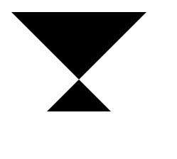
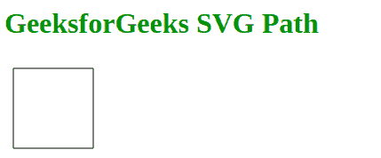

# SVG 路径元素

> 原文:[https://www.geeksforgeeks.org/svg-path-element/](https://www.geeksforgeeks.org/svg-path-element/)

**SVG** 代表可缩放矢量图形。SVG 元素**路径**用于定义从一个位置开始到特定位置结束的路径。SVG 路径可以用来创建任何基本形状。

**语法:**

```html
<path d="Shape of path using keyword like M, L, C etc."
      pathLength="Length of path"
      stroke="stroke color name"
      fill="color name">
</path>

```

**属性:**这个元素接受上面提到的和下面描述的四个属性:

*   **d:** 用于定义路径的形状。
    *   **M:** 用于将一个点移动到某个位置。
    *   **L:** 用来做一条线到一个点。
    *   **C:** 用于对一点做曲线。
*   **路径长度:**用于定义路径的总长度。
*   **笔画:**用于定义笔画颜色。
*   **填充:**用于定义 SVG 的填充颜色。

为了更好地理解 <path>SVG 元素，下面给出了几个例子。</path>

**例 1:**

## 超文本标记语言

```html
<!DOCTYPE html>
<html lang="en">
<head>
  <meta charset="UTF-8">
  <meta name="viewport" 
        content="width=device-width, initial-scale=1.0">
  <title>Document</title>
</head>
<body>
  <svg viewBox="500 500 ">
    <!--Moving point to M10 10 200 200
    making a line to 10 200 200 10 -->
    <path d="M 10 10 200 200 L 10 200 L200 10">
    </path>
  </svg>
</body>
</html>
```

**输出:**


**例 2:**

## 超文本标记语言

```html
<!DOCTYPE html>
<html lang="en">
<head>
  <meta charset="UTF-8">
  <meta name="viewport"
        content="width=device-width, initial-scale=1.0">
  <title>Document</title>
</head>
<body>
  <h1 style="color:green">GeeksforGeeks SVG Path</h1>
  <svg viewBox="500 500">
    // Creating a rectangle starting point is 10, 10
    // Making a line to 10 100
    // Moving point to 10 100
    // Making line to  100 100
    // Moving point to 100 100
    // Making line to  100 10
    // Moving point to 100 10
    // Making line to  10 10 -->
    <path d="M 10 10 L10 100 M10 100 L100 100 M100 
          100 L100 10 M100 10 L10 10" stroke="black">
    </path>
  </svg>
</body>
</html>
```

**输出:**
