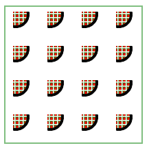

# SVG `<pattern>`元素

> 原文:[https://www.geeksforgeeks.org/svg-pattern-element/](https://www.geeksforgeeks.org/svg-pattern-element/)

SVG 代表可缩放矢量图形。它可以用来在 HTML 画布中制作图形和动画。<pattern>元素用于用由图像组成的图案填充形状。它以平铺的方式填充形状。</pattern>

**语法:**

```html
<pattern> . . .  </pattern>
```

**属性:**

*   **pattern nunits:**定义 x、y、高度、宽度的坐标。
*   **模式内容:**定义模式的区域。
*   **保留纵横比:**它显示了一个元素，该元素带有一个视图框，该视图框给出的纵横比必须适合具有不同纵横比的视口。
*   **xlink:href:** 它定义了对资源的引用 IRI。

**例 1:**

## 超文本标记语言

```html
<!DOCTYPE html>
<html>

<body>
    <svg width="200" height="200">
        <defs>
            <pattern id="pattern" x="0" y="0"
                width="10" height="10" 
                patternUnits="userSpaceOnUse">

                <circle cx="10" cy="10" r="10"
                    style="stroke:lightgreen; 
                        fill:white" />
            </pattern>
        </defs>

        <rect x="10" y="10" width="100" 
            height="100" style="stroke: #000000;
                        fill: url(#pattern);" />

        <g fill="#FFFFFF" stroke="black" 
            font-size="12" font-family="Verdana">

        <text x="13" y="65">
            GeeksForGeeks
        </text>
    </svg>
</body>

</html>
```

**输出:**


**例 2:**

## 超文本标记语言

```html
<!DOCTYPE html>
<html>

<body>
    <svg width="300" height="350">
        <defs>
            <pattern id="in" x="2" y="2" 
                width="6" height="6" 
                patternUnits="userSpaceOnUse">

                <rect x="2" y="2" width="4" 
                    height="8" stroke="green" 
                    fill="red" />
            </pattern>

            <pattern id="out" x="13" y="13" 
                width="50" height="50" 
                patternUnits="userSpaceOnUse">

                <circle cx="4" cy="4" r="18" 
                    stroke="black" 
                    stroke-width="4px" 
                    fill="url(#in)" />
            </pattern>
        </defs>

        <rect x="1" y="5" width="200" 
            height="200" stroke="green" 
            fill="url(#out)" />
    </svg>
</body>

</html>
```

**输出:**

