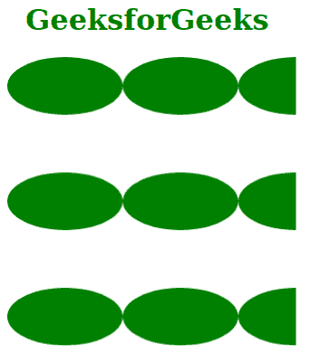
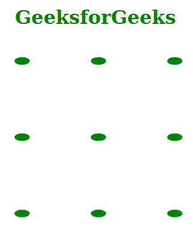

# SVG patternet 属性

> 原文:[https://www . geeksforgeeks . org/SVG-patterncontenttunits-attribute/](https://www.geeksforgeeks.org/svg-patterncontentunits-attribute/)

***图案内容*** 属性用于指示< *图案* >元素的内容必须使用哪个坐标系。

**语法:**

```html
patternContentUnits ="userSpaceOnUse"

// Or 

patternContentUnits ="objectBoundingBox"

```

**属性值:*****模式内容*** 属性接受上述值，如下所述:

*   **userSpaceOnUse:** 表示 *<图案>* 元素内的所有坐标都是指创建图案拼贴时定义的用户坐标系。
*   **对象边界框:**表示 *<图案>* 元素内的所有坐标都是 *<图案>* 元素边界框的分数或百分比值。

**注意:**默认值为*用户空间操作*。

**示例 1:** 以下是使用*对象边界框*值说明*模式内容属性使用的示例。*

## 超文本标记语言

```html
<!DOCTYPE html>
<html>

<body>
    <h1 style="color: green; 
        margin-left: 2%;">
        GeeksforGeeks
    </h1>

    <svg viewBox="0 0 300 200" 
        xmlns="http://www.w3.org/2000/svg">

        <pattern id="geek2" width="40%" 
            height="40%" fill="green" 
            patternContentUnits="objectBoundingBox">

            <ellipse cx=".2" cy=".1" rx=".2" ry=".1" />
        </pattern>

        <rect width="50" height="50" 
            fill="url(#geek2)" />
    </svg>
</body>

</html>
```

**输出:**以下是对应上述代码生成的输出



**示例 2:** 以下是使用*用户空间操作*值说明*模式内容属性使用的示例。*

## 超文本标记语言

```html
<!DOCTYPE html>
<html>

<body>
    <h1 style="color: green;">
        GeeksforGeeks
    </h1>

    <svg viewBox="0 0 200 200" 
        xmlns="http://www.w3.org/2000/svg">

        <pattern id="geek2" width="40%" 
            height="40%" fill="green" 
            patternContentUnits="userSpaceOnUse">

            <ellipse cx="5" cy="5" rx="2" ry="1" />
        </pattern>

        <rect width="50" height="50" 
            fill="url(#geek2)" />
    </svg>
</body>

</html>
```

**输出:**以下是对应上述代码生成的输出

