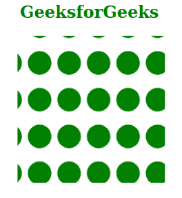
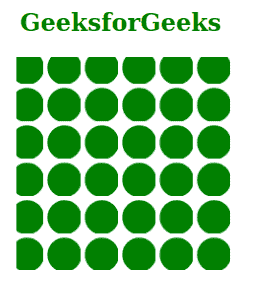

# SVG 模式属性

> 原文:[https://www.geeksforgeeks.org/svg-patternunits-attribute/](https://www.geeksforgeeks.org/svg-patternunits-attribute/)

*模式*属性指定哪个坐标系必须用于 *<模式>* 元素的几何属性。只有 *<图案>* 元素是使用这个属性的。

**语法:**

```html
patternUnits = userSpaceOnUse | objectBoundingBox
```

**属性值:***模式*属性接受上面提到的和下面描述的值:

*   **用户空间操作使用:**它显示当应用模式时，几何属性的所有坐标都参考用户坐标系。
*   **对象边界框:**它显示几何属性的所有坐标表示元素边界框的百分比或分数。

下面的例子说明了*模式*属性的使用。

**例 1:**

## 超文本标记语言

```html
<!DOCTYPE html>
<html>

<body>
    <h2 style="color: green; 
             margin-left: 25px;">
        GeeksforGeeks
    </h2>

    <svg viewBox="0 0 600 100" 
        xmlns="http://www.w3.org/2000/svg">

        <pattern id="geek1" x="-5" 
            fill="green" y="8.5" width="20" 
            height="25" 
            patternUnits="userSpaceOnUse">

            <circle cx="10" cy="10" r="8" />
        </pattern>

        <rect x="10" y="0" width="100" 
            height="100" fill="url(#geek1)" />
    </svg>
</body>

</html>
```

**输出:**



**例 2:**

## 超文本标记语言

```html
<!DOCTYPE html>
<html>

<body>
    <h2 style="color: green; 
            margin-left: 25px;">
        GeeksforGeeks
    </h2>

    <svg viewBox="0 0 600 100" 
        xmlns="http://www.w3.org/2000/svg">

        <pattern id="geek2" x=".125" y=".125"
            width=".175" height=".175" 
            fill="green" 
            patternUnits="objectBoundingBox">

            <circle cx="10" cy="10" r="8" />
        </pattern>

        <rect x="10" y="0" width="100" 
            height="100" fill="url(#geek2)" />
    </svg>
</body>

</html>
```

**输出:**

