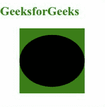
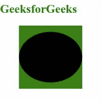

# SVG 指针事件属性

> 原文:[https://www.geeksforgeeks.org/svg-pointer-events-attribute/](https://www.geeksforgeeks.org/svg-pointer-events-attribute/)

*指针事件*属性允许我们定义一个元素是否或何时可能成为鼠标事件的目标。应用于以下元素: *< a >、<圆>、< clipPath >、< defs >、<椭圆>、< foreignObject >、< g >、<图像>、<线>、<标记>、<遮罩>、<路径<*

**语法:**

```html
pointer-events = bounding-box | visiblePainted | visibleFill | 
                 visibleStroke | visible | painted | fill |
                 stroke | all | none
```

**属性值:***指针事件*属性接受上面提到的和下面描述的值:

*   **auto:** 用来描述元素必须对指针事件做出反应。
*   **无:**用于描述元素对指针事件没有反应。
*   **visiblepainded:**当鼠标光标位于元素的内部或周边，并且填充或描边属性设置为非空值时，此值只能作为指针事件的目标。
*   **visibleFill:** 当鼠标光标位于元素内部时，该值只能是指针事件的目标。
*   **visibleStroke:** 当鼠标光标在元素的周界上时，该值只能是指针事件的目标。
*   **可见:**当鼠标光标位于元素内部或周边时，该值只能是指针事件的目标。
*   **绘制:**当鼠标光标位于元素的内部或周边，并且填充或描边属性设置为非空值时，该值只能是指针事件的目标。
*   **填充:**当指针位于元素内部时，该值只能是指针事件的目标。
*   **描边:**当指针在元素的周长上时，该值只能是指针事件的目标。
*   **all:** 当指针位于元素内部或周边时，该值只能是指针事件的目标。

以下示例说明了*指针事件*属性的使用。

**例 1:**

## 超文本标记语言

```html
<!DOCTYPE html>
<html>

<body>
    <div style="color: green;">
        <h2>
            GeeksforGeeks
        </h2>

        <svg viewBox="0 0 100 10" 
            xmlns="http://www.w3.org/2000/svg">

            <rect x="3" y="0" height="10" 
                width="10" fill="green" />

            <ellipse cx="8" cy="5" rx="5" ry="4" 
                fill="black" 
                pointer-events="visiblePainted" />
        </svg>
    </div>

    <script>
        window.addEventListener(
            'mouseup', (e) => {
                let geekColor =
                    Math.round(Math.random() *
                        0xFFFFFF)
                let fill =
                    '#' + geekColor.toString(16).
                        padStart(5, '0')
                e.target.style.fill = fill
            });
    </script>
</body>

</html>
```

**输出:**



**例 2:**

## 超文本标记语言

```html
<!DOCTYPE html>
<html>

<body>
    <div style="color: green;">
        <h2>
            GeeksforGeeks
        </h2>

        <svg viewBox="0 0 100 10" 
            xmlns="http://www.w3.org/2000/svg">

            <rect x="3" y="0" height="10" 
                width="10" fill="green" />

            <ellipse cx="8" cy="5" rx="5" 
                ry="4" fill="black" 
                pointer-events="none" />
        </svg>
    </div>

    <script>
        window.addEventListener(
            'mouseup', (e) => {
                let geekColor =
                    Math.round(Math.random()
                        * 0xFFFFFF)
                let fill =
                    '#' + geekColor.toString(16).
                        padStart(6, '0')
                e.target.style.fill = fill
            });
    </script>
</body>

</html>
```

**输出:**

