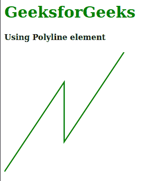
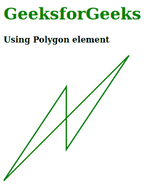

# SVG 点数属性

> 原文:[https://www.geeksforgeeks.org/svg-points-attribute/](https://www.geeksforgeeks.org/svg-points-attribute/)

**点**属性描述了多边形或折线元素的点列表。如果它包含一对奇数坐标，最后一个将被忽略。

使用此属性的元素:

*   <polyline>元素</polyline>
*   <polygon>元素</polygon>

**语法:**

```html
points = numbers

```

**属性值:***点*属性接受上面提到的和下面描述的值

*   **数字:**是用逗号分隔的一对整数和用空格分隔的一组坐标，表示用户坐标系中的一个 X 坐标和一个 Y 坐标。其默认值被视为无。

以下示例说明了*点*属性的使用。

**例 1:**

## 超文本标记语言

```html
<!DOCTYPE html>
<html>

<body>
    <div style="color: green;">
        <h1>
            GeeksforGeeks
        </h1>

        <h4 style="color: black;">
            Using Polyline element
        </h4>

        <svg viewBox="100 0 520 100" 
            xmlns="http://www.w3.org/2000/svg">
            <polyline stroke="green" fill="none"
                points="100,100 150,25 150,75 200,0"/>
        </svg>
    </div>
</body>

</html>
```

**输出:**



**例 2:**

## 超文本标记语言

```html
<!DOCTYPE html>
<html>

<body>
    <div style="color: green;">
        <h1>
            GeeksforGeeks
        </h1>

        <h4 style="color: black;">
            Using Polygon element
        </h4>

        <svg viewBox="100 0 520 100" 
            xmlns="http://www.w3.org/2000/svg">
            <polygon stroke="green" fill="none"
                points="100,100 150,25 150,75 200,0"/>
        </svg>
    </div>
</body>

</html>
```

**输出:**

