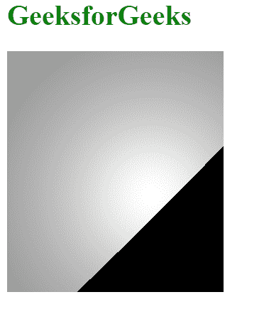
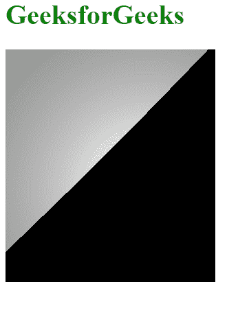

# SVG 点集属性

> 原文:[https://www.geeksforgeeks.org/svg-pointsatz-attribute/](https://www.geeksforgeeks.org/svg-pointsatz-attribute/)

**点 sAtZ** 属性表示光源所指向的点的<滤镜>元素上的primitiveUnits 属性建立的坐标系中的 y 位置。

使用此属性的元素:

*   <fespotlight>元素</fespotlight>

**语法:**

```html
pointsAtZ = number

```

**属性值:**pointsAtZ 属性接受上面提到的和下面描述的值

*   **数字:**是指当前坐标系单位的数值。其默认值为 0。

下面的例子说明了点属性的使用

**例 1:** 在本例中，该点设置为 0。

## 超文本标记语言

```html
<!DOCTYPE html>
<html>

   <body>
        <div style="color: green;">
            <h1>
                GeeksforGeeks
            </h1>

            <svg viewBox="0 0 1120 200" 
                 xmlns="http://www.w3.org/2000/svg">

                <filter id="Geek1" width="100%"
                        height="100%"> 
                    <feDiffuseLighting in="SourceGraphic">
                        <feSpotLight x="120" y="120" 
                            z="50" pointsAtZ="0"/>
                    </feDiffuseLighting>
                </filter>

                <rect width="200" height="250"
                      style="filter: url(#Geek1);"/>
              </svg>
        </div>
   </body>

</html>
```

**输出:**



**示例 2:** 在本示例中，该点被设置为 200

## 超文本标记语言

```html
<!DOCTYPE html>
<html>

<body>
    <div style="color: green;">
        <h1>
            GeeksforGeeks
        </h1>

        <svg viewBox="0 0 1120 200" 
             xmlns="http://www.w3.org/2000/svg">

            <filter id="Geek2" width="100%"
                height="100%">
                <feDiffuseLighting in="SourceGraphic">
                    <feSpotLight x="120" y="120" 
                        z="50" pointsAtZ="200"/>
                </feDiffuseLighting>
            </filter>

            <rect width="200" height="250" 
                  style="filter: url(#Geek2);"/>
          </svg>
    </div>
</body>

</html>
```

**输出:**

