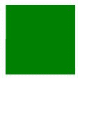
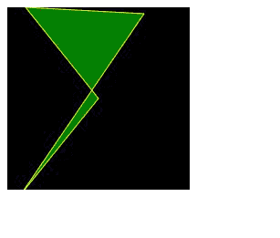

# SVG 多边形元素

> 原文:[https://www.geeksforgeeks.org/svg-polygon-element/](https://www.geeksforgeeks.org/svg-polygon-element/)

SVG 代表可缩放矢量图形。它可以用来制作像在 HTML 画布中的图形和动画。SVG 的 **<多边形>** 元素用于在 SVG 上制作任何类型的多边形，并定义由一组相连的直线段组成的闭合形状。

**语法:**

```html
<polygon  points="Pair of points required to draw the shape"
      stroke="stroke color"
      fill="fill color for colored closed shapes">
```

**属性:**

*   **点:**绘制形状所需的一对点
*   **路径长度:**它告诉路径的总长度。

为了更好地理解 <polygon>SVG 元素，下面给出了几个例子。</polygon>

**例 1:**

```html
<!DOCTYPE html>
<html lang="en">
<head>
  <meta charset="UTF-8">
  <meta name="viewport" 
        content="width=device-width,
                 initial-scale=1.0">
  <title>Document</title>
</head>
<body>
  <svg width="400px" height="400px">
  <!-- try different pairs and make different shapes-->
    <polygon points="0, 100 100, 100 100, 100 100, -20000" 
             fill="green">
  </svg>
</body>
</html>
```

**输出:**



**例 2:**

```html
<!DOCTYPE html>
<html lang="en">
<head>
  <meta charset="UTF-8">
  <meta name="viewport" 
        content="width=device-width,
                 initial-scale=1.0">
  <title>Document</title>
</head>
<style>
  svg{
    background-color: black;
  }
</style>
<body>
  <svg width="200px" height="200px">
  <!-- try different pairs and make different shapes-->
    <polygon points="100, 100 15, 205 150, 7 20, 0"
              fill="green" stroke="yellow">
  </svg>
</body>
</html>
```

**输出:**



**支持的浏览器:**下面给出的是这个 svg 元素支持的浏览器。

*   铬
*   边缘
*   歌剧
*   微软公司出品的 web 浏览器
*   旅行队
*   火狐浏览器