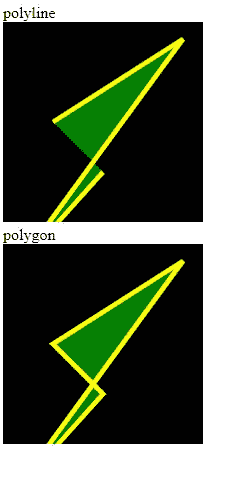
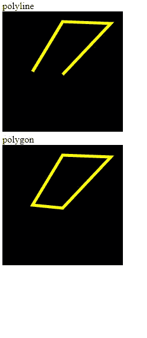

# SVG 折线元素

> 原文:[https://www.geeksforgeeks.org/svg-polyline-element/](https://www.geeksforgeeks.org/svg-polyline-element/)

HTML 中 SVG 的 **<折线>** 元素是用来通过不同的点连接线条来创建形状的。它不同于<多边形>，因为它可以用来创建开放的形状。

**语法:**

```html
<polyline points="Pair of points required to draw the shape"
      stroke="stroke color"
      fill="fill color for colored closed shapes">

```

**属性:**

*   **点:**绘制形状所需的一对点
*   **路径长度:**它告诉路径的总长度。

为了更好地理解 <polyline>SVG 元素，下面给出了几个例子。</polyline>

**例 1:**

## 超文本标记语言

```html
<!DOCTYPE html>
<html lang="en">
<head>
  <meta charset="UTF-8">
  <meta name="viewport" 
        content="width=device-width, initial-scale=1.0">
  <title>Document</title>
</head>
<style>
  svg{
    background-color: black;
  }
</style>
<body>
  polyline <br>  
  <svg width="200px" height="200px">
    <polyline points="100,150 10,250 180,17 50,100"
              fill="green" stroke="yellow" 
              stroke-width="5">
  </svg><br>
  polygon <br>
  <svg width="200px" height="200px">
    <polygon points="100,150 10,250 180,17 50,100"
             fill="green" stroke="yellow" 
             stroke-width="5">
  </svg>
</body>
</html>
```

**输出:**



**例 2:**

## 超文本标记语言

```html
<!DOCTYPE html>
<html lang="en">
<head>
  <meta charset="UTF-8">
  <meta name="viewport" 
        content="width=device-width, initial-scale=1.0">
  <title>Document</title>
</head>
<style>
  svg{
    background-color: black;
  }
</style>
<body>
  polyline <br>  
  <svg width="200px" height="200px">
    <polyline points="100,105 180,20 100,17 50,100"
              stroke="yellow" stroke-width="5">
  </svg><br>
  polygon <br>
  <svg width="200px" height="200px">
    <polygon points="100,105 180,20 100,17 50,100"
             stroke="yellow" stroke-width="5">
  </svg>
</body>
</html>
```

**输出:**



**支持的浏览器:**

*   铬
*   边缘
*   歌剧
*   微软公司出品的 web 浏览器
*   旅行队
*   火狐浏览器