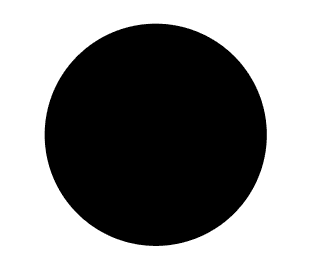
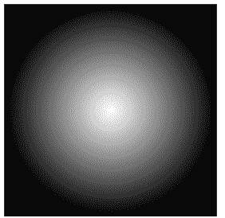

# SVG r 属性

> 原文:[https://www.geeksforgeeks.org/svg-r-attribute/](https://www.geeksforgeeks.org/svg-r-attribute/)

**r** 属性定义圆的半径。

**语法:**

```html
r="radius"

```

**属性值:**

*   **长度:**我们要设置半径的长度。
*   **百分比:**我们要设置半径的百分比。

我们将使用 r 属性来设置圆的半径

**示例 1:**

## 超文本标记语言

```html
<!DOCTYPE html> 
<html> 

<body> 
    <svg viewBox="0 0 300 200" 
        xmlns="http://www.w3.org/2000/svg">

        <circle cx="40" cy="40" r="25"/>
    </svg>
</body> 

</html>
```

**输出:**



**示例 2:**

## 超文本标记语言

```html
<!DOCTYPE html>
<html>

<body>
    <svg viewBox="0 0 300 200" 
        xmlns="http://www.w3.org/2000/svg">

        <radialGradient r="50%" id="myGradient00">
            <stop offset="0" stop-color="white" />
            <stop offset="100%" stop-color="black" />
        </radialGradient>

        <rect x="5" y="5" width="60" height="60" 
            fill="url(#myGradient00)" />
    </svg>
</body>

</html>
```

**输出:**

