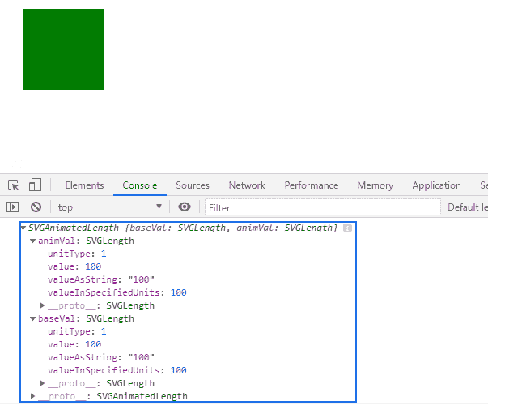
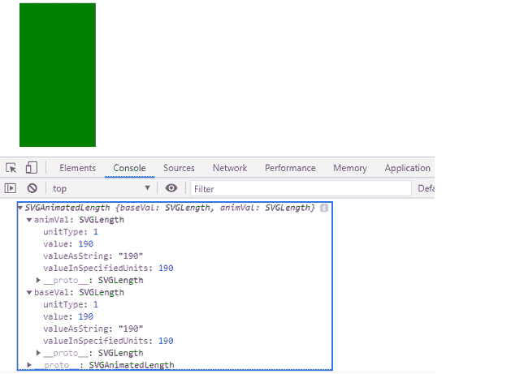

# SVG 矩形元素高度属性

> 原文:[https://www . geesforgeks . org/SVG-rect element-height-property/](https://www.geeksforgeeks.org/svg-rectelement-height-property/)

**SVG RectElement.height** 属性返回一个与 HTML 网页的 SVG 元素的 *rect* 元素相关的**svorganimatedlength**。

**语法:**

```html
RectElement.height

```

**返回值:**该属性返回 *SVGAnimatedLength* 对象，该对象可用于获取*矩形*元素的“高度”

**例 1:**

## 超文本标记语言

```html
<!DOCTYPE html>
<html>

<body>
    <svg width="350" height="350" 
        xmlns="http://www.w3.org/2000/svg">

        <rect width="100" height='100' 
            fill="green" id="gfg" x=20 y=40 />

        <script>
            var g = document.getElementById("gfg");
            console.log(g.height)
        </script>
    </svg>
</body>

</html>
```

**输出:**



**例 2:**

## 超文本标记语言

```html
<!DOCTYPE html>
<html>

<body>
    <svg width="350" height="350" 
        xmlns="http://www.w3.org/2000/svg">

        <rect width="100" height='190' 
            fill="green" id="gfg" x=20 y=40 />

        <script>
            var g = document.getElementById("gfg");
            console.log(g.height)
        </script>
    </svg>
</body>

</html>
```

**输出:**

