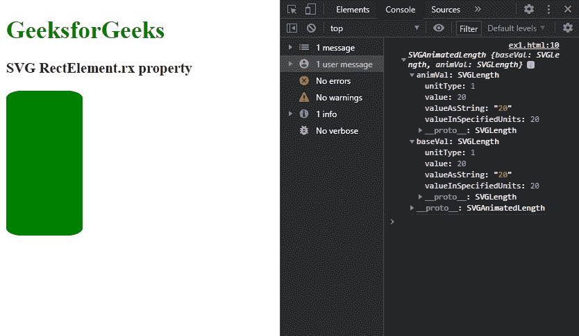
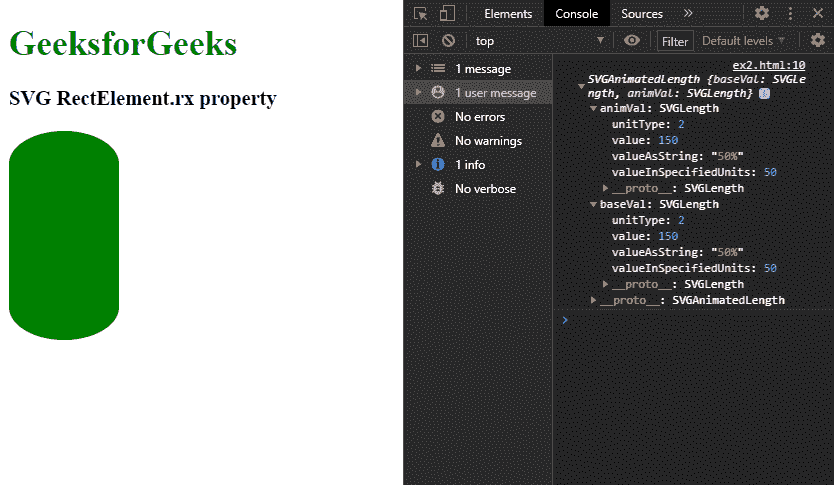

# SVG 矩形元素. rx 属性

> 原文:[https://www.geeksforgeeks.org/svg-rectelement-rx-property/](https://www.geeksforgeeks.org/svg-rectelement-rx-property/)

**SVG RectElement.rx 属性**用于 r 返回对应于给定矩形角度元素属性的 SVGAnimatedLength 对象。

**语法:**

```html
RectElement.rx

```

**返回值:**该属性返回一个 SVGAnimatedLength 对象，该对象可用于获取矩形元素的“rx”值和其他属性。

**例 1:**

## 超文本标记语言

```html
<!DOCTYPE html>
<html>

<body>
    <h1 style="color: green">
        GeeksforGeeks
    </h1>

    <h3>SVG RectElement.rx property</h3>

    <svg width="300" height="300" 
        xmlns="http://www.w3.org/2000/svg">

        <rect width="100" height='190' 
            fill="green" id="gfg" 
            rx=20 ry=10 />

        <script>
            var g = document.getElementById("gfg");
            console.log(g.rx)
        </script>
    </svg>
</body>

</html>
```

**输出:**



**例 2:**

## 超文本标记语言

```html
<!DOCTYPE html>
<html>

<body>
    <h1 style="color: green">
        GeeksforGeeks
    </h1>

    <h3>SVG RectElement.rx property</h3>

    <svg width="300" height="300" 
        xmlns="http://www.w3.org/2000/svg">

        <rect width="100" height='190' 
            fill="green" id="gfg" rx=50% ry=10% />

        <script>
            var g = document.getElementById("gfg");
            console.log(g.rx);
        </script>
    </svg>
</body>

</html>
```

**输出:**

