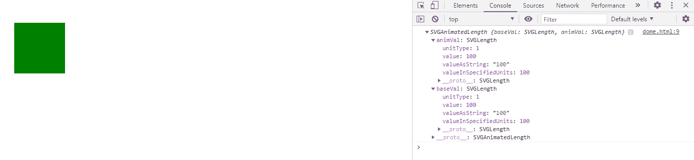
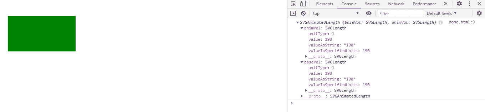

# SVG 矩形元素宽度属性

> 原文:[https://www . geesforgeks . org/SVG-rect element-width-property/](https://www.geeksforgeeks.org/svg-rectelement-width-property/)

**SVG 矩形元素宽度属性** 返回一个对应于给定矩形角度元素属性的 SVGAnimatedLength。

**语法:**

```html
RectElement.width
```

**返回值:**该属性返回 SVGAnimatedLength 对象，该对象可用于获取矩形元素的宽度

**例 1:**

## 超文本标记语言

```html
<!DOCTYPE html>
<html>

<body>
    <svg width="350" height="150" 
        xmlns="http://www.w3.org/2000/svg">

        <rect width="100" height='100' 
            fill="green" id="gfg" x=20 y=40 />

        <script>
            var g = document.getElementById("gfg");
            console.log(g.width)
        </script>
    </svg>
</body>

</html>
```

**输出:**



**例 2:**

## 超文本标记语言

```html
<!DOCTYPE html>
<html>

<body>
    <svg width="350" height="150" 
        xmlns="http://www.w3.org/2000/svg">

        <rect width="190" height='100' 
            fill="green" id="gfg" x=20 y=40 />

        <script>
            var g = document.getElementById("gfg");
            console.log(g.width)
        </script>
    </svg>
</body>

</html>
```

**输出:**

