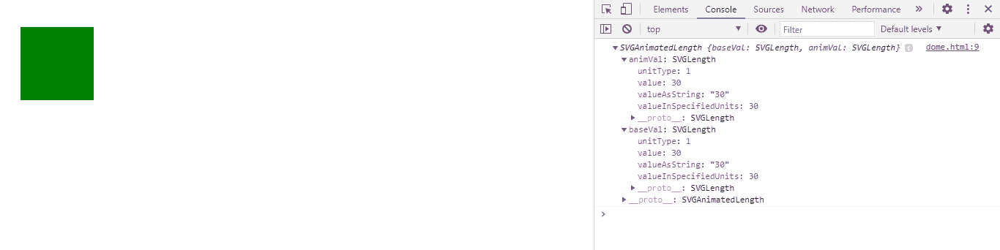
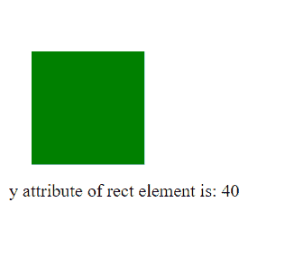

# SVG 矩形元素. y 属性

> 原文:[https://www.geeksforgeeks.org/svg-rectelement-y-property/](https://www.geeksforgeeks.org/svg-rectelement-y-property/)

属性 返回一个对应于给定矩形角度元素属性的 SVGAnimatedLength。

**语法:**

```html
RectElement.y
```

**返回值:**该属性返回 SVGAnimatedLength 对象，该对象可用于获取矩形元素的 y 轴。

**例 1:**

## 超文本标记语言

```html
<!DOCTYPE html> 
<html> 

<body> 
    <svg width="350" height="150" 
        xmlns="http://www.w3.org/2000/svg">
        <rect width="100" height='100' 
            fill="green" id="gfg" x=20 y=30 />

        <script>
            var g = document.getElementById("gfg");
            console.log(g.y)
        </script>
    </svg>
</body> 

</html>
```

**输出:**



**例 2:**

## 超文本标记语言

```html
<!DOCTYPE html> 
<html> 

<body> 
    <svg width="350" height="150" 
        xmlns="http://www.w3.org/2000/svg">

        <rect width="100" height='100' 
            fill="green" id="gfg" x=20 y=40 />

        <div id="abc"></div>

        <script>
            var g = document.getElementById("gfg");
            var abc = document.getElementById("abc");
            abc.innerHTML = 
                "y attribute of rect element is: "
                + g.y.baseVal.value;
        </script>
    </svg>
</body> 

</html>
```

**输出:**

