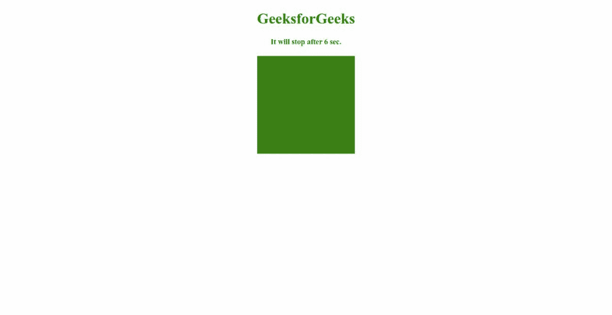
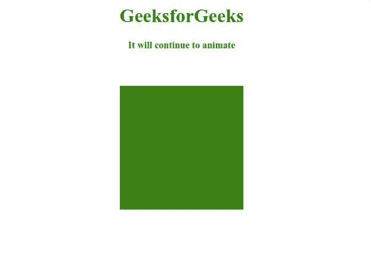

# SVG 重复计数属性

> 原文:[https://www.geeksforgeeks.org/svg-repeatcount-attribute/](https://www.geeksforgeeks.org/svg-repeatcount-attribute/)

*重复计数*属性指定动画的持续时间。使用该属性的元素包括 *<动画>、<动画生态器>、<动画情感>、<动画转换>、*和 *<设置>*

**语法:**

```html
repeatCount = number || indefinite

```

**属性值:***重复计数*属性接受上面提到的和下面描述的值。

*   **数字:**表示迭代次数。这些值从大于 0 开始。
*   **不定:**指定动画无限重复。

**示例 1:** 以下示例说明了*重复计数*属性的使用。

## 超文本标记语言

```html
<!DOCTYPE html>
<html>

<body>
    <div style="color: green; 
          text-align: center;">
        <h1>GeeksforGeeks</h1>

        <h4>It will stop after 6 sec.</h4>

        <svg viewBox="0 0 620 150" 
            xmlns="http://www.w3.org/2000/svg">

            <rect x="260" y="0" fill="green" 
                width="100" height="100">

                <animate attributeType="XML" 
                    attributeName="y" from="0" 
                    to="50" dur="1s" repeatCount="6" />
            </rect>
        </svg>
    </div>
</body>

</html>
```

**输出:**



**例 2:**

## 超文本标记语言

```html
<!DOCTYPE html>
<html>

<body>
    <div style="color: green; 
             text-align: center;">
        <h1>GeeksforGeeks</h1>

        <h4>It will continue to animate</h4>

        <svg viewBox="0 0 620 150" 
            xmlns="http://www.w3.org/2000/svg">

            <rect x="260" y="0" fill="green" 
                width="100" height="100">

                <animate attributeType="XML" 
                    attributeName="y" from="0" 
                    to="50" dur="1s" 
                    repeatCount="indefinite" />
            </rect>
        </svg>
    </div>
</body>

</html>
```

**输出:**

