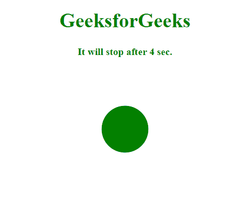
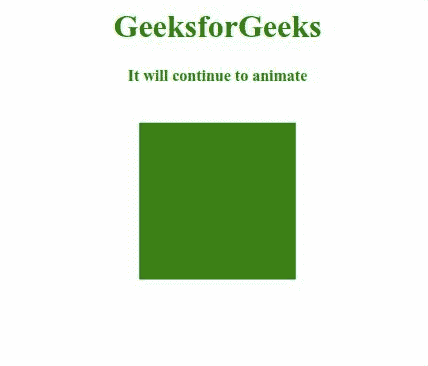

# SVG 重复属性

> 原文:[https://www.geeksforgeeks.org/svg-repeatdur-attribute/](https://www.geeksforgeeks.org/svg-repeatdur-attribute/)

***重复*** 属性指定重复动画的总持续时间。

使用此属性的元素有:

*   <animate>元素</animate>
*   <animatecolor>元素</animatecolor>
*   <animatemotion>元素</animatemotion>
*   <animatetransform>元素</animatetransform>
*   <set>元素</set>

**语法:**

```html
repeatDur = clock-value || indefinite

```

**属性值:***重复*属性接受上面提到的和下面描述的值:

*   **时钟值:**表示重复动画的持续时间。
*   **不定:**指定动画无限重复。

下面的例子说明了 *repeatDur* 属性的使用。

**例 1:**

## 超文本标记语言

```html
<!DOCTYPE html>
<html>
<body>
    <div style="color: green; 
       text-align: center;">

        <h1>
            GeeksforGeeks
        </h1>
        <h4>
            It will stop 
            after 4 sec.
        </h4>

        <svg viewBox="-360 0 820 150" 
            xmlns="http://www.w3.org/2000/svg">
            <circle cx="50" cy="50" r='20' 
                fill ="green">
                <animate attributeName="cy" 
                    from="10" to="50"
                    dur="1s" repeatDur="4s"/>
            </circle>
        </svg>
    </div> 
</body>

</html>
```

**输出:**



**例 2:**

## 超文本标记语言

```html
<!DOCTYPE html>
<html>

<body>
    <div style="color: green; 
        text-align: center;">
        <h1>
          GeeksforGeeks
        </h1>
        <h4>
          It will continue to animate
        </h4> 

        <svg viewBox="-360 0 820 150" 
            xmlns="http://www.w3.org/2000/svg">
            <rect y="0" width="100"
                 fill ="green" height="100">
                <animate attributeName="y" 
                    from="0" to="40"
                    dur="1s" 
                    repeatDur="indefinite"/>
            </rect> 
        </svg>
    </div> 
</body>

</html>
```

**输出:**

