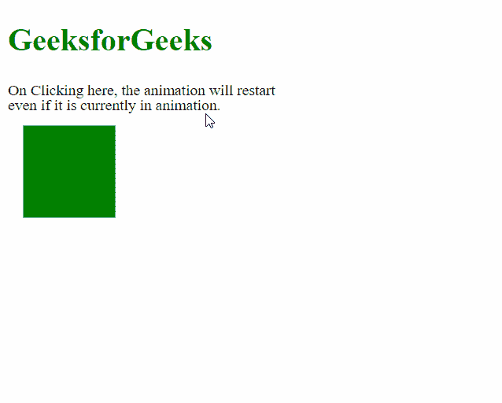

# SVG 重启属性

> 原文:[https://www.geeksforgeeks.org/svg-restart-attribute/](https://www.geeksforgeeks.org/svg-restart-attribute/)

**重启**属性用于决定动画是否重启。该属性由 *<动画><动画生态器><动画情感><动画转换>和<设置>* 元素使用。

**语法:**

```html
restart="always | whenNotActive | never"

```

**属性值:**该属性接受三个值，如上所述，如下所述:

*   **始终:**指定动画始终可以重启。
*   **当不活动时:**它指定动画只有在不活动时才能重新开始。如果一个人试图在动画活动期间重启动画，那么这些尝试将被忽略。
*   **never:** 指定加载文档时不能重启动画。

以下示例说明了该属性的用法:

**例 1:**

## 超文本标记语言

```html
<!DOCTYPE html>
<html>

<body>
    <div style="color: green;">
        <h1>GeeksforGeeks</h1>

        <svg viewBox="0 0 520 200" 
            xmlns="http://www.w3.org/2000/svg">

            <rect y="30" x="10" width="60" 
                height="60" fill="green">

                <animate attributeName="x" 
                    from="10" to="50" dur="1s" 
                    repeatCount="1" 
                    restart="always" />
            </rect>

            <a id="geeks" style="cursor: pointer;">
                <text style="font-size: 10px;" y="10">
                    On Clicking here, the
                    animation will restart
                </text>
                <text style="font-size: 10px;" y="20">
                    even if it is currently
                    in animation.
                </text>
            </a>
        </svg>
    </div>
    <script>
        document.getElementById("geeks")
            .addEventListener("click", event => {
                document.querySelector("animate")
                    .beginElement();
            });
    </script>
</body>

</html>
```

**输出:**



**例 2:**

## 超文本标记语言

```html
<!DOCTYPE html>
<html>

<body>
    <div style="color: green;">
        <h1>GeeksforGeeks</h1>

        <svg viewBox="0 0 520 200" 
            xmlns="http://www.w3.org/2000/svg">

            <rect y="30" x="10" width="60" 
                height="60" fill="green">

                <animate attributeName="x" 
                    from="10" to="50" dur="1s" 
                    repeatCount="1" 
                    restart="whenNotActive" />
            </rect>

            <a id="geeks" style="cursor: pointer;">
                <text style="font-size: 10px;" y="10">
                    On Clicking here, the
                    animation will only
                </text>
                <text style="font-size: 10px;" y="20">
                    restart when it is not
                    currently active.
                </text>
            </a>
        </svg>
    </div>
    <script>
        document.getElementById("geeks")
            .addEventListener("click", event => {
                document.querySelector("animate")
                    .beginElement();
            });
    </script>
</body>

</html>
```

**输出:**

