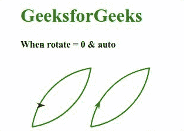
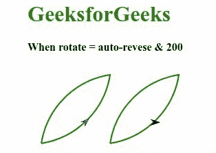

# SVG 旋转属性

> 原文:[https://www.geeksforgeeks.org/svg-rotate-attribute/](https://www.geeksforgeeks.org/svg-rotate-attribute/)

*旋转*属性显示动画元素在 *<【动画情感】>* 元素中沿指定路径移动时的旋转。

**语法:**

```html
rotate = auto | auto-reverse | number
```

**属性值:***旋转*属性接受上面提到的和下面描述的值:

*   **自动:**该值允许动画元素沿路径移动时旋转动态变化。在这种情况下，元素会在当前运动方向上将其自身与右侧对齐。
*   **自动反转:**该值允许动画元素沿路径移动时旋转动态变化。在这种情况下，元素会在当前运动方向上将其自身与左侧对齐。
*   **数字:**该值显示恒定的旋转，不会随着动画而改变。

以下示例说明了*旋转*属性的使用。

**例 1:**

## 超文本标记语言

```html
<!DOCTYPE html>
<html>

   <body>
       <div style="color: green;
            margin-left: 40px;">

          <h1>GeeksforGeeks</h1>

          <h4 style="color: black;">
               When rotate = 0 & auto
          </h4>

          <svg width="400" height="120"
               viewBox="0 0 380 120"
               xmlns="http://www.w3.org/2000/svg">

                <path d="M10,110 A120,120 -45 0,
                         1 110 10 A120,120 -45 0,
                         1 10,110"
                         stroke="green" stroke-width="2"
                         fill="none" id="geek"/>

                <path fill="red"
                      d="M-5,-5 L10,0 -5,5 0,0 Z"> 
                      <animateMotion dur="6s"
                        repeatCount="indefinite"
                        rotate="0">
                        <mpath href="#geek"/>
                      </animateMotion>
                </path>

                <g transform="translate(100, 0)">
                   <use href="#geek"/>
                   <path fill="green"
                      d="M-5,-5 L10,0 -5,5 0,0 Z">
                      <animateMotion dur="6s"
                        repeatCount="indefinite"
                        rotate="auto">
                        <mpath href="#geek"/>
                      </animateMotion>
                   </path>
                </g>

            </svg>
       </div>
   </body>

</html>
```

**输出:**



## 超文本标记语言

```html
<!DOCTYPE html>
<html>

   <body>
       <div style="color: green;
            margin-left: 40px;">

          <h1>GeeksforGeeks</h1>

         <h4 style="color: black;">
             When rotate = auto-reverse & 200
          </h4>

          <svg width="600" height="120"
               viewBox="50 0 480 120"
               xmlns="http://www.w3.org/2000/svg">

                <g>
                   <path d="M10,110 A120,120 -45 0,
                            1 110 10 A120,120 -45 0,
                            1 10,110"
                            stroke="green" stroke-width="2"
                            fill="none" id="geek"/>

                     <path fill="blue"
                          d="M-5,-5 L10,0 -5,5 0,0 Z">
                          <animateMotion dur="6s"
                             repeatCount="indefinite"
                             rotate="auto-reverse">
                               <mpath href="#geek"/>
                          </animateMotion>
                     </path>
                </g>

                <g transform="translate(100, 0)">
                    <path d="M10,110 A120,120 -45 0,
                            1 110 10 A120,120 -45 0,
                            1 10,110"
                            stroke="green" stroke-width="2"
                            fill="none" id="geek"/>

                     <path fill="black"
                          d="M-5,-5 L10,0 -5,5 0,0 Z">
                          <animateMotion dur="6s"
                             repeatCount="indefinite"
                             rotate="200">
                             <mpath href="#geek"/>
                          </animateMotion>
                         </path>
                </g>

            </svg>
       </div>
   </body>

</html>
```

**输出:**

