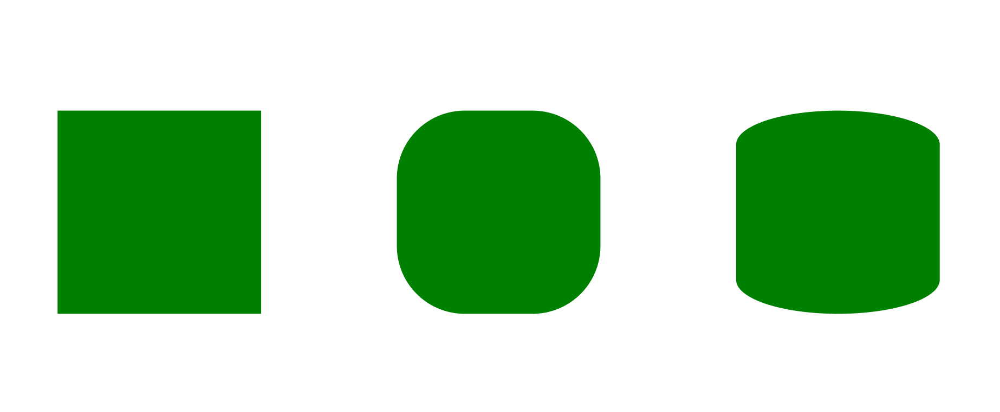

# SVG rx 属性

> 原文:[https://www.geeksforgeeks.org/svg-rx-attribute/](https://www.geeksforgeeks.org/svg-rx-attribute/)

**rx** 属性定义了 x 轴上的半径。

使用此属性的元素:

**语法:**

```html
rx = "x-radius"
```

**属性值:**

*   **长度:**我们要设置 x 半径的长度。
*   **百分比:**我们要设置 x 半径的百分比。

我们将使用 rx 属性来设置 x 轴上的半径。

**例 1:**

```html
<!DOCTYPE html>
<html>

<body>
    <svg viewBox="0 0 300 300" 
        xmlns="http://www.w3.org/2000/svg">

        <ellipse cx="50" cy="50" 
            rx="20" ry="20" fill="green" />

        <ellipse cx="100" cy="50" 
            rx="20" ry="25" fill="green" />
    </svg>
</body>

</html>
```

**输出:**


**例 2:**

```html
<!DOCTYPE html>
<html>

<body>
    <svg viewBox="0 0 300 300" 
        xmlns="http://www.w3.org/2000/svg">

        <rect x="20" y="120" width="60" height="60" 
                rx="0" ry="0" fill="green" />

        <rect x="120" y="120" width="60" height="60"
                rx="20" ry="20" fill="green" />

        <rect x="220" y="120" width="60" height="60"
                rx="150" ry="10" fill="green" />
    </svg>
</body>

</html>
```

**输出:**

