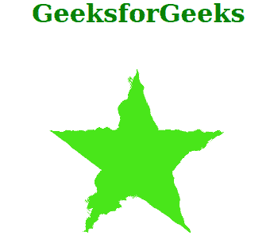

# SVG 比例属性

> 原文:[https://www.geeksforgeeks.org/svg-scale-attribute/](https://www.geeksforgeeks.org/svg-scale-attribute/)

*比例*属性决定了必须在 *<置换贴图>* 滤镜图元上使用的置换比例因子。只有*<fe 置换贴图>* 元素在使用这个属性。

**语法:**

```html
scale = "number"
```

**属性值:***等级*属性接受上面提到的和下面描述的值

*   **数:**可以是整数，也可以是带小数的数。默认值等于 0。

以下示例说明了*比例*属性的使用。

**例 1:**

## 超文本标记语言

```html
<!DOCTYPE html>
<html>

<body>
    <div style="color: green; 
             margin-left: 50px;">

        <h1>GeeksforGeeks</h1>

        <svg viewBox="0 0 480 100" 
            xmlns="http://www.w3.org/2000/svg">

            <filter id="geek1" x="-20%" y="-20%" 
                width="150%" height="150%">

                <feTurbulence type="turbulence" 
                    baseFrequency="0.10" 
                    numOctaves="2" 
                    result="turbulence" />

                <feDisplacementMap in2="turbulence" 
                    in="SourceGraphic" scale="5" />
            </filter>

            <polygon points="50, 9 60.5, 39.5 92.7,
                40.1 67, 59.5 76.4, 90.3 50, 71.9 
                23.6, 90.3 32.9, 59.5 7.2, 40.1 
                39.4,39.5" style="filter: url(#geek1);"
                fill="hsl(106,80%,50%)" />
        </svg>
    </div>
</body>

</html>
```

**输出:**



**例 2:**

## 超文本标记语言

```html
<!DOCTYPE html>
<html>

<body>
    <div style="color: green; 
             margin-left: 50px;">

        <h1>GeeksforGeeks</h1>

        <svg viewBox="0 0 480 100" 
            xmlns="http://www.w3.org/2000/svg">

            <filter id="geek2" x="-20%" y="-20%" 
                width="150%" height="150%">

                <feTurbulence type="turbulence" 
                    baseFrequency="0.05" 
                    numOctaves="2" 
                    result="turbulence" />

                <feDisplacementMap in2="turbulence" 
                    in="SourceGraphic" scale="20" />
            </filter>

            <polygon points="50, 9 60.5, 39.5 92.7,
                40.1 67, 59.5 76.4, 90.3 50, 71.9 
                23.6, 90.3 32.9, 59.5 7.2, 40.1 
                39.4, 39.5" style="filter: url(#geek2);"
                fill="hsl(106,80%,50%)" />
        </svg>
    </div>
</body>

</html>
```

**输出:**

