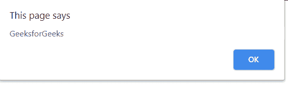
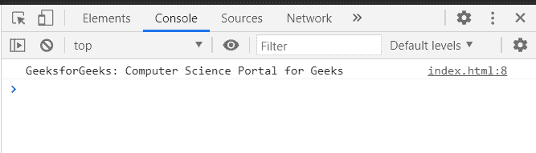

# SVG `<script>`元素

> 原文:[https://www.geeksforgeeks.org/svg-script-element/](https://www.geeksforgeeks.org/svg-script-element/)

SVG 代表可缩放矢量图形。它可以用来制作像在 HTML 画布中的图形和动画。

SVG `<strong>` <脚本>元素允许向 SVG 文档添加脚本。

**语法:**

```html
<script>
    // Script Here 
</script>
```

**属性:**

*   **交叉原点:**这定义了 COS 设置。
*   **href:** 这定义了要加载的 href URL。
*   **类型:**要使用的语言或脚本的类型。
*   **全局属性:**使用了一些全局属性，如核心属性、造型属性等。

**例 1:**

```html
<!DOCTYPE html>
<html>

<body>
    <svg width="400" height="200"
        xmlns="http://www.w3.org/2000/svg">
        <script type="text/javascript">
            alert("GeeksforGeeks"); 
        </script>    
    </svg>
</body>

</html>
```

**输出:**



**例 2:**

```html
<!DOCTYPE html>
<html>

<body>
    <svg width="400" height="200"
        xmlns="http://www.w3.org/2000/svg">
        <script>
            console.log(
"GeeksforGeeks: Computer Science Portal for Geeks"); 
        </script>    
    </svg>
</body>

</html>
```

**输出:**



**支持的浏览器:**此 SVG 元素支持以下浏览器:

*   铬
*   边缘
*   火狐浏览器
*   旅行队
*   微软公司出品的 web 浏览器
*   歌剧