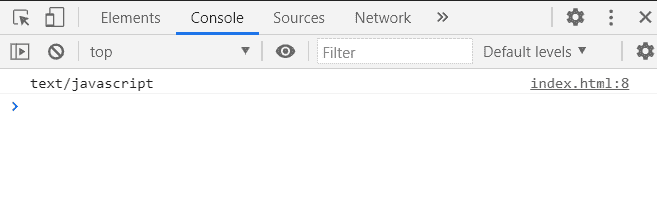
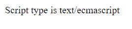

# SVG 脚本元素类型属性

> 原文:[https://www . geesforgeks . org/SVG-script element-type-property/](https://www.geeksforgeeks.org/svg-scriptelement-type-property/)

SVG `<em>` ScriptElement.type 属性返回一个对应于给定脚本元素属性的 SVGAnimatedLength 对象。

**语法:**

```html
ScriptElement.type
```

**返回值:**该属性返回可用于获取脚本元素类型的 SVGAnimatedLength 对象。

**例 1:**

## 超文本标记语言

```html
<!DOCTYPE html> 
<html> 

<body> 
    <script type="text/javascript">
        console.log('GeeksforGeeks')
    </script>
</body> 

</html>
```

**输出:**



**例 2:**

## 超文本标记语言

```html
<!DOCTYPE html> 
<html> 

<body> 
    <script type="text/ecmascript">
        document.write('GeeksforGeeks')
    </script>
</body> 

</html>
```

**输出:**

