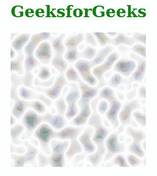
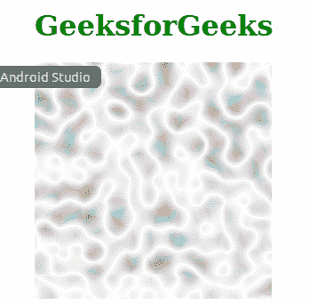

# SVG 种子属性

> 原文:[https://www.geeksforgeeks.org/svg-seed-attribute/](https://www.geeksforgeeks.org/svg-seed-attribute/)

*种子*属性表示 *<模糊>* 过滤器原语的伪随机数生成器的起始号码。只有< *的* >元素正在使用这个属性。

**语法:**

```html
seed = "number"
```

**属性值:***种子*属性接受上面提到的和下面描述的值

*   **数:**可以是整数，也可以是带小数的数。默认值等于 0。

以下示例说明了*种子*属性的使用。

**例 1:**

## 超文本标记语言

```html
<!DOCTYPE html>
<html>

<body>
    <div style="color: green; 
              margin-left: 50px;">

        <h1>GeeksforGeeks</h1>

        <svg viewBox="0 0 920 200" 
            xmlns="http://www.w3.org/2000/svg">

            <filter id="geek1" x="0" y="0" 
                width="100%" height="100%">

                <feTurbulence baseFrequency="0.050" 
                    seed="0" />
            </filter>

            <rect x="0" y="0" width="200" 
                height="200" 
                style="filter:url(#geek1);" />
        </svg>
    </div>
</body>

</html>
```

**输出:**



**例 2:**

## 超文本标记语言

```html
<!DOCTYPE html>
<html>

<body>
    <div style="color: green; 
                margin-left: 50px;">

        <h1>GeeksforGeeks</h1>

        <svg viewBox="0 0 920 200" 
            xmlns="http://www.w3.org/2000/svg">

            <filter id="geek2" x="0" y="0" 
                width="100%" height="100%">

                <feTurbulence baseFrequency="0.050"
                    seed="100" />
            </filter>

            <rect x="0" y="0" width="200" 
                height="200" 
                style="filter:url(#geek2);" />
        </svg>
    </div>
</body>

</html>
```

**输出:**

