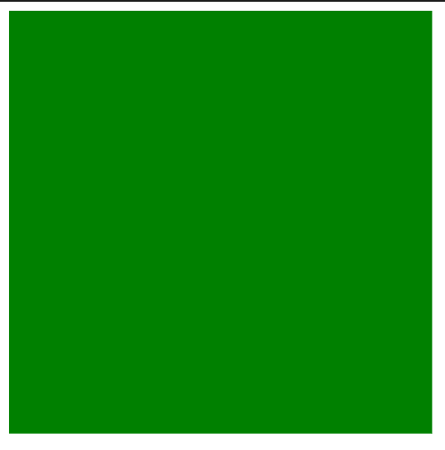
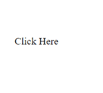

# SVG `<set>`元素

> 原文:[https://www.geeksforgeeks.org/svg-set-element/](https://www.geeksforgeeks.org/svg-set-element/)

SVG 代表可缩放矢量图形。它可以用来制作像在 HTML 画布中的图形和动画。

SVG `<strong>` <设置>元素提供了一种简单的方法，只需在指定的持续时间内设置属性值。它支持所有属性类型，包括那些不能合理插值的属性，如字符串和布尔值。

**语法:**

```html
<set attributeName="" value="" />
```

**属性:**

*   **至:** 该属性定义动画持续时间内应用于目标属性的值。
*   **动画属性:**用于赋予动画效果、exp 计时属性、事件属性、数值属性等的属性。
*   **全局属性:**使用了一些全局属性，如核心属性、造型属性等。

**例 1:**

```html
<!DOCTYPE html>
<html>

<body>
    <svg viewBox="0 0 40 40" 
         xmlns="http://www.w3.org/2000/svg">
        <rect id="me" width="10" height="10">
            <set attributeName="fill" to="green" />
          </rect>
    </svg>
</body>

</html>
```

**输出:**



**例 2:**

```html
<!DOCTYPE html>
<html>

<body>
    <svg width="400" height="200"
        xmlns="http://www.w3.org/2000/svg">
        <a>
            <text x="50" y="90" text-anchor="middle">
                Click Here
            </text>
            <set attributeName="href" 
                 to="https://youtu.be/Abwl8g65BLQ" />
        </a>
    </svg>
</body>

</html>
```

**输出:**



**支持的浏览器:**

*   铬
*   边缘
*   火狐浏览器
*   旅行队
*   微软公司出品的 web 浏览器
*   歌剧