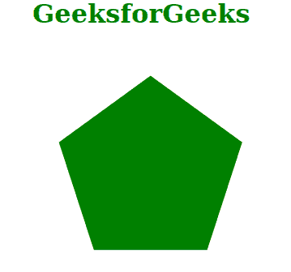
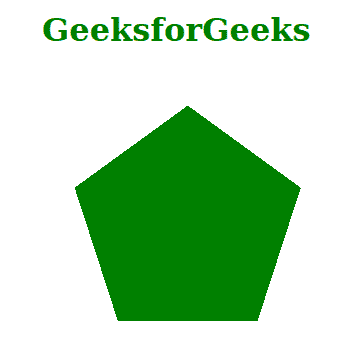

# SVG 形状渲染属性

> 原文:[https://www . geesforgeks . org/SVG-shape-rendering-attribute/](https://www.geeksforgeeks.org/svg-shape-rendering-attribute/)

*形状渲染*属性提示渲染器在渲染路径、圆形或矩形等形状时要做出的权衡。仅对以下元素有影响: *<圆><椭圆><线><路径><多边形><折线><矩形>。*

**语法:**

```html
shape-rendering = auto | optimizeSpeed | crispEdges 
                       | geometricPrecision
```

**属性值:***形状渲染*属性接受上面提到的和下面描述的值:

*   **auto:** 这个值让用户代理做出自动决策来平衡速度，有清晰的边缘或者有良好的几何精度。如果未指定任何内容，则该值将作为默认值。
*   **优化速度:**该值允许用户代理指定以强调速度而不是几何精度或清晰边缘的方式渲染形状。
*   **清晰边缘:**该值允许用户代理指定渲染形状时强调清晰边缘相对于几何精度或速度的对比度。
*   **几何精度:**该值允许用户代理指定以几何精度渲染形状，而不是关注速度或清晰的边缘。

**示例 1:** 以下示例说明了使用*几何精度*属性值来使用*形状渲染*属性。

## 超文本标记语言

```html
<!DOCTYPE html>
<html>

<body>
    <div style="color: green; 
             margin-left: 50px;">
        <h1>
            GeeksforGeeks
        </h1>

        <svg viewBox="0 0 420 100" 
            xmlns="http://www.w3.org/2000/svg">

            <polygon points="26, 86 11.2, 40.4 50, 
                12.2 88.8, 40.4 74, 86" fill="green"
                shape-rendering="geometricPrecision" />
        </svg>
    </div>
</body>

</html>
```

**输出:**



**示例 2:** 以下示例说明了使用*crispredges*属性值来使用*形状渲染*属性。

## 超文本标记语言

```html
<!DOCTYPE html>
<html>

<body>
    <div style="color: green; 
               margin-left: 50px;">

        <h1>GeeksforGeeks</h1>

        <svg viewBox="0 0 420 100" 
            xmlns="http://www.w3.org/2000/svg">

            <polygon points="26, 86 11.2, 40.4 
                50, 12.2 88.8, 40.4 74, 86" 
                fill="green" 
                shape-rendering="crispEdges" />
        </svg>
    </div>
</body>

</html>
```

**输出:**

