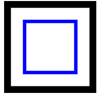
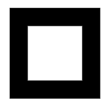

# SVG `<solidcolor>`元素

> 哎哎哎:# t0]https://www . geeksforgeeks . org/SVG-solid color 元素/

SVG 代表可缩放矢量图形。它可以用来制作 HTML 网页结构的图形和动画。<solidcolor>元素在多个地方为一个 SVG 输入定义一种颜色。它定义了一个调色板，并允许它在整个文档中一致使用。</solidcolor>

**语法:**

```html
<solidColor />

```

**属性:**没有特定属性。

**例 1:**

## 超文本标记语言

```html
<!DOCTYPE html>
<html>

<body>

    <svg viewBox="0 0 200 200">
        <defs>
            <solidColor id="color" 
                solid-color="#a080ff" 
                solid-opacity="0.5" />
        </defs>
        <g>
            <rect fill="none" stroke="blue" 
                x="6" y="6" width="15" 
                height="15" />

            <rect fill="url(#color)" 
                stroke="black" stroke-width="2" 
                x="1" y="1" width="25" 
                height="25" />
        </g>
    </svg>
</body>

</html>
```

**输出:**



**例 2:**

## 超文本标记语言

```html
<!DOCTYPE html>
<html>

<body>
    <svg viewBox="0 0 220 220">
        <defs>
            <solidColor id="MyLightPurple"
                solid-color="black" 
                solid-opacity="1" />
        </defs>

        <rect fill="url(#MyLightPurple)" 
            stroke="black" stroke-width="5" 
            x="6" y="6" width="20" 
            height="20" />
    </svg>
</body>

</html>
```

**输出:**

