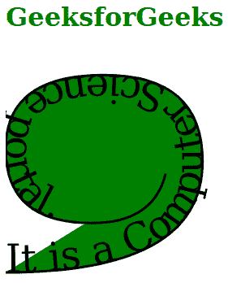
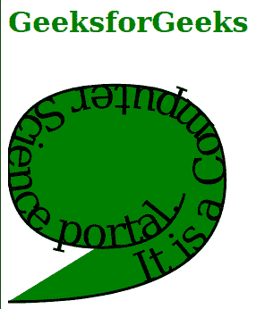

# SVG 启动偏移属性

> 原文:[https://www.geeksforgeeks.org/svg-startoffset-attribute/](https://www.geeksforgeeks.org/svg-startoffset-attribute/)

*开始偏移*属性决定初始文本位置的路径开始。这是在将路径转换到 *<文本路径>* 元素的坐标系后完成的。只有 *< textPath >* 元素在使用这个属性。

**语法:**

```html
startOffset = length-percentage | number

```

**属性值:***开始偏移*属性接受上面提到的和下面描述的值:

*   **长度-百分比:**它列举了沿着<文本路径>元素的整个路径的百分比长度。
*   **数字:**是指当前坐标系单位的数值。

下面的例子说明了 *startOffset* 属性的使用。

**例 1:**

## 超文本标记语言

```html
<!DOCTYPE html>
<html>

<body>
    <h1 style="color: green;">
        GeeksforGeeks
    </h1>

    <svg viewBox="10 0 420 200" 
        xmlns="http://www.w3.org/2000/svg">

        <path id="geek1" fill="green" 
            stroke="black" d="M10, 90 Q90,
            90 90, 45 Q90, 10 50, 10 Q10,
            10 10, 40 Q10, 70 45, 70 Q70, 
            70 75, 50" />

        <text>
            <textPath href="#geek1" startOffset="0">
                It is a Computer Science portal.
            </textPath>
        </text>
    </svg>
</body>

</html>
```

**输出:**



**例 2:**

## 超文本标记语言

```html
<!DOCTYPE html>
<html>

<body>
    <h1 style="color: green;">
        GeeksforGeeks
    </h1>

    <svg viewBox="130 0 420 200" 
        xmlns="http://www.w3.org/2000/svg">

        <path id="geek2" fill="green" 
            stroke="black" d="M130, 90 Q210,
            90 210, 45 Q210, 10 170, 10 Q130,
            10 130, 40 Q130, 70 165, 70 Q190,
            70 195, 50" />

        <text>
            <textPath href="#geek2" startOffset="50">
                It is a Computer Science portal.
            </textPath>
        </text>
    </svg>
</body>

</html>
```

**输出:**

