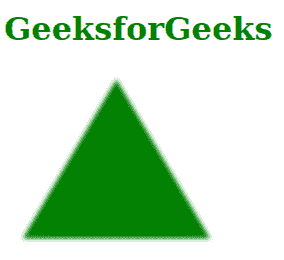
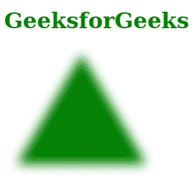
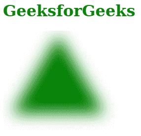

# SVG 标准差属性

> 原文:[https://www.geeksforgeeks.org/svg-stddeviation-attribute/](https://www.geeksforgeeks.org/svg-stddeviation-attribute/)

**标准差**属性解释了模糊操作的标准差。只有 *<费高辛布尔>* 元素正在使用这个属性。

**语法:**

```html
stdDeviation = <number-optional-number>

```

**属性值:***标准偏差*属性接受上面提到的和下面描述的值

*   **数字-可选-数字:**是一对数字。第一个数字表示沿 X 轴的标准偏差值。第二个值表示沿 Y 轴的标准偏差值。如果只给出一个值，则认为它是沿两个轴的标准偏差。

**注意:***标准偏差*的默认值为 0。

**示例 1:** 下面的示例说明了当值为 1 时使用*标准偏差*

## 超文本标记语言

```html
<!DOCTYPE html>
<html>

<body>
    <h1 style="color: green;">
        GeeksforGeeks
    </h1>

    <svg viewBox="-10 10 680 400" 
        xmlns="http://www.w3.org/2000/svg">

        <filter id="geek1">
            <feGaussianBlur stdDeviation="1" />
        </filter>

        <polygon points="50 15, 100 100, 0 100"
            fill="green" 
            style="filter: url(#geek1);" />
    </svg>
</body>

</html>
```

**输出:**



**示例 2:** 以下示例说明了当值为 4 时*标准偏差*的使用。

## 超文本标记语言

```html
<!DOCTYPE html>
<html>

<body>
    <h1 style="color: green;">
        GeeksforGeeks
    </h1>

    <svg viewBox="-10 10 680 400" 
        xmlns="http://www.w3.org/2000/svg">

        <filter id="geek2">
            <feGaussianBlur stdDeviation="4" />
        </filter>

        <polygon points="50 15, 100 100, 0 100"
            fill="green" 
            style="filter: url(#geek2);" />
    </svg>
</body>

</html>
```

**输出:**



**示例 3:** 以下示例说明了当值为 8 时*标准偏差*的使用

## 超文本标记语言

```html
<!DOCTYPE html>
<html>

<body>
    <h1 style="color: green;">
        GeeksforGeeks
    </h1>

    <svg viewBox="-10 10 680 400" 
        xmlns="http://www.w3.org/2000/svg">

        <filter id="geek3" x="-30%" y="-30%" 
            width="160%" height="160%">
            <feGaussianBlur stdDeviation="8" />
        </filter>

        <polygon points="50 15, 100 100, 0 100" 
            fill="green" 
            style="filter: url(#geek3);" />
    </svg>
</body>

</html>
```

**输出:**

