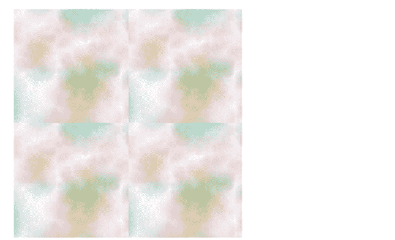
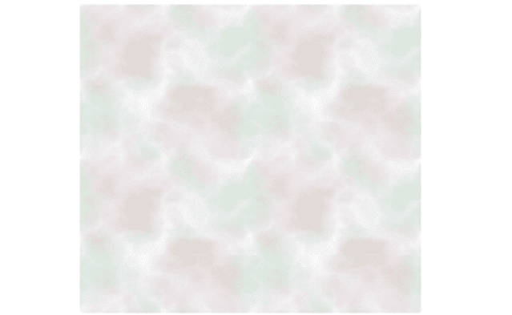

# SVG 拼接属性

> 原文:[https://www.geeksforgeeks.org/svg-stitchtiles-attribute/](https://www.geeksforgeeks.org/svg-stitchtiles-attribute/)

*stitchTiles* 属性指示边界处**柏林噪波**图块的行为。只有<fetumble>原语在使用这个属性。*滤镜*是 SVG 的重要滤镜原语之一，有助于模拟云或烟等自然纹理。

**语法:**

```html
stitchTiles = stitch | noStitch
```

**属性值:***拼接*属性接受上面提到的和下面描述的值。

*   **针脚:**表示用户会自动调整基频的 x、y 值。
*   **noStitch:** 表示没有尝试在包含湍流函数的图块边界实现平滑过渡。

**示例 1:** 以下示例说明了 *stitchTiles* 属性的使用。SVG`<i>`fetumble 滤镜原语用于创建自己的扭曲效果。这里 *noStitch* 选项用于 *stitchTiles* 属性。

## 超文本标记语言

```html
<!DOCTYPE html>
<html>

<body>
    <h2 style="color: green; font-size: 40px;">
        GeeksforGeeks
    </h2>

    <p style="margin-left:30px;">
        <b>SVG filter effects</b>
    </p>

    <!--SVG container for graphical images -->
    <svg viewBox="0 0 620 400" 
        xmlns="http://www.w3.org/2000/svg">

        <!--Adding filter element for 
            special effects -->
        <filter id="filterID1" x="0" y="0" 
            width="100%" height="100%">

            <!-- feTurbulence to fill the 
                region with no smoothness-->
            <feTurbulence baseFrequency="0.035" 
                numOctaves="8" seed="5" 
                stitchTiles="noStitch" />
            <!-- "noStitch" option is given above 
                for NO smooth noise-->
        </filter>

        <!--Variations of rectangle is used -->
        <rect x="10" y="0" width="50" height="50" 
            style="filter: url(#filterID1);" />

        <rect x="10" y="0" width="50" height="50" 
            style="filter: url(#filterID1); 
            transform: translate(50px, 0);" />

        <!--translate is used for moving to new 
            location -->
        <rect x="10" y="0" width="50" height="50" 
            style="filter: url(#filterID1); 
            transform: translate(0, 50px);" />

        <rect x="10" y="0" width="50" height="50" 
            style="filter: url(#filterID1); 
            transform: translate(50px, 50px);" />
    </svg>
</body>

</html>
```

**输出:**



**例 2:**

## 超文本标记语言

```html
<!DOCTYPE html>
<html>

<body>
    <h2 style="color: green; font-size:30px; 
        margin-left:10px;">
        GeeksforGeeks
    </h2>

    <p style="margin-left:30px;">
        <b>SVG filter effects</b>
    </p>

    <svg viewBox="200 0 720 500" 
        xmlns="http://www.w3.org/2000/svg">

        <!-- stitchTiles attribute have values 
            as "stitch" or "noStitch"-->
        <filter id="filterID" x="0" y="0" 
            width="100%" height="100%">

            <!-- feTurbulence fills the region 
                with some content with perlin 
                turbulence function-->
            <feTurbulence baseFrequency="0.025" 
                numOctaves="8" seed="5" 
                stitchTiles="stitch" />
            <!-- "stitch" option is given above 
                for smooth noise -->
        </filter>

        <!-- Variations of rectangle is used -->
        <rect width="50" height="50" 
            style="filter: url(#filterID);              
            transform: translate(220px, 0);" />

        <!-- Translate is used for moving 
            to new location -->
        <rect width="50" height="50" 
            style="filter: url(#filterID); 
            transform: translate(270px, 0);" />

        <rect width="50" height="50" 
            style="filter: url(#filterID); 
            transform: translate(220px, 50px);" />

        <rect width="50" height="50" 
            style="filter: url(#filterID); 
            transform: translate(270px, 50px);" />
    </svg>
</body>

</html> 
```

**输出:**

