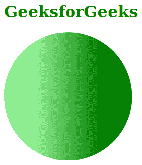
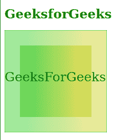

# SVG 停止颜色属性

> 原文:[https://www.geeksforgeeks.org/svg-stop-color-attribute/](https://www.geeksforgeeks.org/svg-stop-color-attribute/)

**停止颜色**属性用于指示要在渐变停止点使用的颜色。它只对<停止>元素有影响。该属性的默认值为“黑色”。

**语法:**

```html
stop-color = currentcolor | color | icccolor
```

**属性值:**该属性接受上面提到的和下面描述的值:

*   **当前颜色:**表示当前填充颜色。
*   **颜色:**表示颜色值。
*   **icccolor:** 表示 ICC 颜色轮廓。

以下示例说明了*停止颜色*属性的使用。

**例 1:**

## 超文本标记语言

```html
<!DOCTYPE html>
<html>

<body>
    <h1 style="color: green;">
        GeeksforGeeks
    </h1>

    <svg viewBox="0 0 50 10" 
        xmlns="http://www.w3.org/2000/svg" 
        xmlns:xlink="http://www.w3.org/1999/xlink">

        <defs>
            <linearGradient id="geek">
                <stop offset="25%" 
                    stop-color="lightgreen" />

                <stop offset="75%" 
                    stop-color="green" />
            </linearGradient>
        </defs>

        <circle cx="5" cy="5" r="5" 
            fill="url('#geek')" />
    </svg>
</body>

</html>
```

**输出:**



**例 2:**

## 超文本标记语言

```html
<!DOCTYPE html>
<html>

<body>
    <h1 style="color: green;">
        GeeksforGeeks
    </h1>

    <svg height="200" width="200">
        <defs>
            <linearGradient id="gradient">
                <stop offset="20%" 
                    stop-color="rgb(20, 200, 0)" 
                    stop-opacity="0.4" />

                <stop offset="80%" 
                    stop-color="rgb(200, 200, 0)" 
                    stop-opacity="0.4" />
            </linearGradient>
        </defs>

        <rect width="100%" height="100%" 
            fill="url(#gradient)" 
            style="stroke: green;" />

        <rect x="30" y="30" width="70%" 
            height="70%" fill="url(#gradient)" />

        <text fill="Green" y="100" font-size="25">
            GeeksForGeeks
        </text>
    </svg>
</body>

</html>
```

**输出:**

