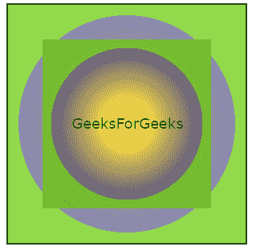
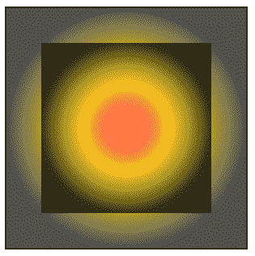
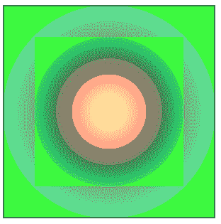
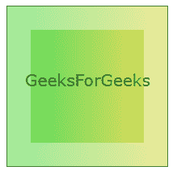

# SVG `<stop>`元素

> 原文:[https://www.geeksforgeeks.org/svg-stop-element/](https://www.geeksforgeeks.org/svg-stop-element/)

SVG 代表可缩放矢量图形。它可以用来制作像在 HTML 画布中的图形和动画。它是渐变元素中定义的值。该值指示要在父元素中使用的颜色和位置。

**语法:**

```html
<stop offset="" stop-color="" stop-opacity="" />
```

**属性:**

*   **偏移量:**表示渐变停止点沿渐变矢量的位置距离。
*   **停止颜色:**告诉颜色在停止点使用。
*   **停止-不透明度:**它告诉阿尔法值或不透明度在停止点使用。默认值为 1。

**例 1:**

```html
<!DOCTYPE html>
<html>

<body>
    <svg width="300" height="300" 
        viewBox="0 0 100 100">

        <defs>
            <radialGradient id="gradient">
                <stop offset="20%" 
                    stop-color="gold" 
                    stop-opacity="0.5" />

                <stop offset="90%" 
                    stop-color="rgb(0, 0, 100)" 
                    stop-opacity="0.5" />

                <stop offset="70%" 
                    stop-color="rgb(100, 200, 0)" 
                    stop-opacity="0.7" />
            </radialGradient>
        </defs>

        <rect x="0" y="0" width="100%" 
            height="100%" fill="url(#gradient)" 
            style=" stroke: black;" />

        <rect x="15" y="15" width="70%" 
            height="70%" fill="url(#gradient)" />

        <text fill="Green" font-size="6" 
            font-family="Verdana" x="27" 
            y="52">GeeksForGeeks</text>
    </svg>
</body>

</html>
```

**输出:**



**例 2:**

```html
<!DOCTYPE html>
<html>

<body>
    <svg width="300" height="300" 
        viewBox="0 0 100 100">

        <defs>
            <radialGradient id="gradient">
                <stop offset="10%" 
                    stop-color="red" 
                    stop-opacity="0.4" />

                <stop offset="50%" 
                    stop-color="gold" 
                    stop-opacity="0.7" />

                <stop offset="100%" 
                    stop-color="shadow" 
                    stop-opacity="0.7" />
            </radialGradient>
        </defs>

        <rect x="0" y="0" width="100%" 
            height="100%" fill="url(#gradient)" 
            style=" stroke: black;" />

        <rect x="15" y="15" width="70%" 
            height="70%" fill="url(#gradient)" />
    </svg>
</body>

</html>
```

**输出:**



**例 3:**

```html
<!DOCTYPE html>
<html>

<body>
    <svg width="300" height="300" 
        viewBox="0 0 100 100">

        <defs>
            <radialGradient id="gradient">
                <stop offset="10%" 
                    stop-color="gold" 
                    stop-opacity="0.2" />

                <stop offset="50%" 
                    stop-color="red" 
                    stop-opacity="0.3" />

                <stop offset="0%" 
                    stop-color="shadow" 
                    stop-opacity="0.4" />

                <stop offset="100%" 
                    stop-color="rgb(0, 300, 100)" 
                    stop-opacity="0.7" />

                <stop offset="10%" 
                    stop-color="rgb(0, 300, 0)" 
                    stop-opacity="0.7" />
            </radialGradient>
        </defs>

        <rect x="0" y="0" width="100%" 
            height="100%" fill="url(#gradient)" 
            style=" stroke: black;" />

        <rect x="15" y="15" width="70%" 
            height="70%" fill="url(#gradient)" />
    </svg>
</body>

</html>
```

**输出:**



**例 4:**

```html
<!DOCTYPE html>
<html>

<body>
    <svg height="200" width="200">
        <defs>
            <linearGradient id="gradient">
                <stop offset="10%" 
                    stop-color="rgb(20, 200, 0)" 
                    stop-opacity="0.4" />

                <stop offset="95%" 
                    stop-color="rgb(200, 200, 0)" 
                    stop-opacity="0.4" />
            </linearGradient>
        </defs>

        <rect x="0" y="0" width="100%" 
            height="100%" fill="url(#gradient)" 
            style=" stroke: black;" />

        <rect x="30" y="30" width="70%" 
            height="70%" fill="url(#gradient)" />

        <text fill="Green" font-size="20" 
            font-family="Verdana" x="23" y="100">
            GeeksForGeeks
        </text>
    </svg>
</body>

</html>
```

**输出:**

