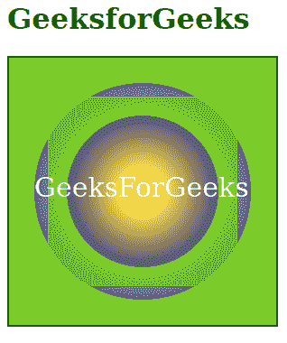
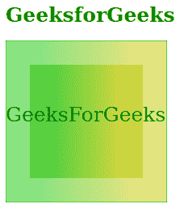

# SVG 停止-不透明度属性

> 原文:[https://www.geeksforgeeks.org/svg-stop-opacity-attribute/](https://www.geeksforgeeks.org/svg-stop-opacity-attribute/)

**停止-不透明度**属性表示要在停止点使用的 alpha 值或不透明度。它只对 **<停止>** 元素有作用。默认值为 1。

**语法:**

```html
stop-opacity = opacity-value
```

**属性值:**停止不透明度属性接受上面提到的和下面描述的值

*   **不透明度值:**表示 0 到 1 之间的数字或百分比值。

以下示例说明了不透明度属性的使用。

**例 1:**

## 超文本标记语言

```html
<!DOCTYPE html> 
<html> 

     <body> 
             <h1 style="color: green;">
              GeeksforGeeks
          </h1>
          <svg width="300" height="300"
               viewBox="0 0 100 100"> 
               <defs> 
                  <radialGradient id="gradient"> 
                      <stop offset="20%"
                       stop-color="gold"
                       stop-opacity="0.5"/> 

                      <stop offset="80%"
                       stop-color="rgb(0, 0, 100)"
                       stop-opacity="0.6"/> 

                      <stop offset="70%"
                       stop-color="rgb(100, 200, 0)"
                       stop-opacity="0.8"/> 
                  </radialGradient> 
               </defs> 

               <rect x="0" y="0" 
                    width="100%"
                    height="100%" 
                    fill="url(#gradient)"
                    style=" stroke: black;" /> 

               <rect x="15" y="15" 
                    width="70%"
                    height="70%" 
                    fill="url(#gradient)" /> 

               <text fill="white" 
                    font-size="10"
                    x="10" y="52">
                    GeeksForGeeks
               </text> 
          </svg> 
     </body> 

</html>
```

**输出:**



**例 2:**

## 超文本标记语言

```html
<!DOCTYPE html> 
<html> 

     <body> 
          <h1 style="color: green; 
              font-size: 25px;">
              GeeksforGeeks
          </h1>
          <svg height="200" width="200"> 
              <defs> 
                  <linearGradient id="gradient"> 
                     <stop offset="20%"
                      stop-color="rgb(20, 200, 0)"
                      stop-opacity="0.5"/> 

                     <stop offset="80%"
                      stop-color="rgb(200, 200, 0)"
                      stop-opacity="0.5"/> 
                  </linearGradient> 
               </defs> 

               <rect width="100%"
                    height="100%" 
                    fill="url(#gradient)"
                    style=" stroke: green;"/> 

               <rect x="30" y="30" 
                    width="70%"
                    height="70%" 
                    fill="url(#gradient)"/> 

               <text fill="Green" y="100"
                    font-size="25"> 
                    GeeksForGeeks 
               </text> 
          </svg> 
     </body> 

</html>
```

**输出:**

