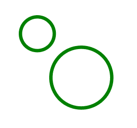
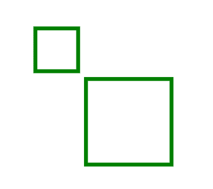

# SVG 笔画属性

> 原文:[https://www.geeksforgeeks.org/svg-stroke-attribute/](https://www.geeksforgeeks.org/svg-stroke-attribute/)

**笔画**属性是定义用于绘制形状轮廓的颜色的属性

**语法:**

```html
stroke= "color"
```

**属性值:**

*   **绘制:**我们要绘制元素的颜色。

我们将使用笔画属性来设置元素的颜色。

**例 1:** 在本例中，我们将使用笔画属性来设置圆元素的颜色。

```html
<!DOCTYPE html>
<html>

<body>
    <svg viewBox="0 0 200 100" 
        xmlns="http://www.w3.org/2000/svg">

        <circle cx="10" cy="10" r="5" 
            fill="none" stroke="green" />

        <circle cx="23" cy="23" r="9" 
            fill="none" stroke="green" />
    </svg>
</body>

</html>
```

**输出:**



**示例 2:** 在本例中，我们将使用笔画属性来设置 rect 元素的颜色。

```html
<!DOCTYPE html>
<html>

<body>
    <svg viewBox="0 0 200 100" 
        xmlns="http://www.w3.org/2000/svg">

        <rect x="10" y="10" height="11" 
            width="11" fill="none" stroke="green" />

        <rect x="23" y="23" height="22" 
            width="22" fill="none" stroke="green" />
    </svg>
</body>

</html>
```

**输出:**

