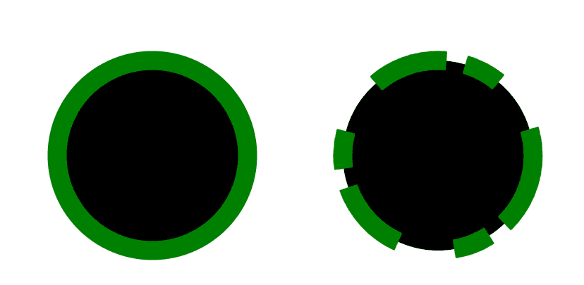

# SVG 笔画-dasharray 属性

> 原文:[https://www . geesforgeks . org/SVG-stroke-dash array-attribute/](https://www.geeksforgeeks.org/svg-stroke-dasharray-attribute/)

**描边-dasharray** 属性是定义用于绘制形状轮廓的虚线图案的表示属性。

**语法:**

```html
stroke-dasharray="number pattern"
```

**属性值:**

*   **dasharray:** 将具有的图案笔划。

我们将使用 stroke-dash array 属性来设置笔画的模式。

**示例 1:** 在本例中，我们将使用笔画-dasharray 属性来设置线条的图案。

```html
<!DOCTYPE html> 
<html> 

<body> 
    <svg viewBox="0 0 50 20" 
         xmlns="http://www.w3.org/2000/svg">

        <line x1="0" y1="1" x2="30" y2="1" stroke="green" />

        <line x1="0" y1="3" x2="30" y2="3" stroke="green"
        stroke-dasharray="4 1 2 3" />
    </svg>
</body> 

</html>
```

**输出:**


**示例 2:** 在本例中，我们将使用笔画-dasharray 属性来设置圆形的图案

```html
<!DOCTYPE html> 
<html> 

<body> 
    <svg viewBox="0 0 50 21" 
         xmlns="http://www.w3.org/2000/svg">

        <circle x="12" y="3" r="5" 
                cx="10" cy="10" stroke="green"/>

        <circle x="12" y="3" r="5" 
                cx="25" cy="10" stroke="green"
        stroke-dasharray="4 1 2 3" />
    </svg>
</body> 

</html>
```

**输出:**

