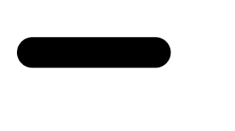

# SVG 笔画-线帽属性

> 原文:[https://www.geeksforgeeks.org/svg-stroke-linecap-attribute/](https://www.geeksforgeeks.org/svg-stroke-linecap-attribute/)

**笔划线帽**属性定义了要在打开的子路径末端使用的笔划形状。这是表示属性。

**语法:**

```html
stroke-linecap="shapes"
```

**属性值:**

*   **对接:**该属性值表示笔画没有延伸到其两个端点之外。
*   **round:** 该属性值表示笔划将延伸半个圆，其直径等于其端点处的笔划宽度。
*   **正方形:**该属性值表示笔画将在其端点延伸一个矩形。

我们将使用 stroke-line cap 属性来定义笔画的形状。

**例 1:**

```html
<!DOCTYPE html> 
<html> 

<body> 
    <svg viewBox="0 0 35 30" 
         xmlns="http://www.w3.org/2000/svg">

        <line x1="1" y1="1" x2="5" y2="1" stroke="black"
        stroke-linecap="butt" />

    </svg>
</body> 

</html>
```

**输出:**


**例 2:**

```html
<!DOCTYPE html> 
<html> 

<body> 
    <svg viewBox="0 0 35 30" 
         xmlns="http://www.w3.org/2000/svg">

        <line x1="1" y1="3" x2="5" y2="3" stroke="black"
        stroke-linecap="round" />

    </svg>
</body> 

</html>
```

**输出:**



**例 3:**

```html
<!DOCTYPE html> 
<html> 

<body> 
    <svg viewBox="0 0 35 30" 
         xmlns="http://www.w3.org/2000/svg">

        <line x1="1" y1="5" x2="5" y2="5" stroke="black"
        stroke-linecap="square" />

    </svg>
</body> 

</html>
```

**输出:**

