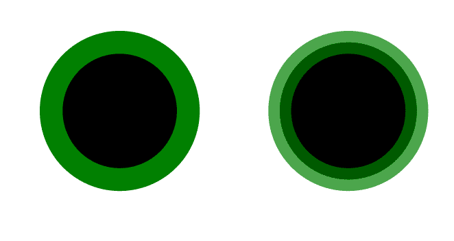
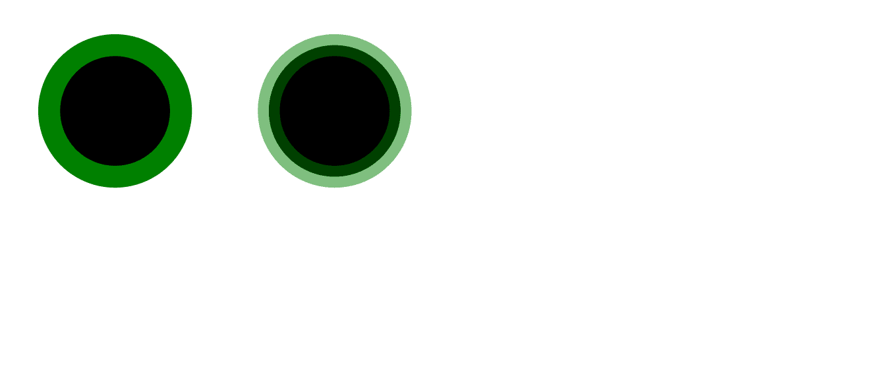

# SVG 笔画-不透明度属性

> 原文:[https://www.geeksforgeeks.org/svg-stroke-opacity-attribute/](https://www.geeksforgeeks.org/svg-stroke-opacity-attribute/)

**笔画不透明度**属性指定一个对象或一组对象的透明度。

**语法:**

```html
stroke-opacity= "opacity"
```

**属性值:**

*   **十进制:**0-1 范围内的十进制值
*   **百分比:**我们要设置元素不透明度的百分比

我们将使用斯托克城不透明度属性来设置元素的不透明度。

**示例 1:** 在本例中，我们将使用笔画-不透明度属性来设置使用十进制属性的圆形元素的不透明度。

```html
<!DOCTYPE html> 
<html> 

<body> 
    <svg viewBox="0 0 40 10" 
         xmlns="http://www.w3.org/2000/svg">
        <circle cx="5" cy="5" r="4" stroke="green" />

        <circle cx="15" cy="5" r="4" stroke="green"
        stroke-opacity="0.7" />

    </svg>
</body> 

</html>
```

**输出:**



**示例 2:** 在本例中，我们将使用笔画-不透明度属性来使用百分比属性设置圆形元素的不透明度。

```html
<!DOCTYPE html> 
<html> 

<body> 
    <svg viewBox="0 0 40 35" 
         xmlns="http://www.w3.org/2000/svg">
        <circle cx="5" cy="5" r="3" stroke="green" />

        <circle cx="15" cy="5" r="3" stroke="green"
        stroke-opacity="50%" />

    </svg>
</body> 

</html>
```

**输出:**

