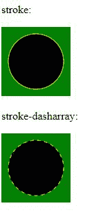
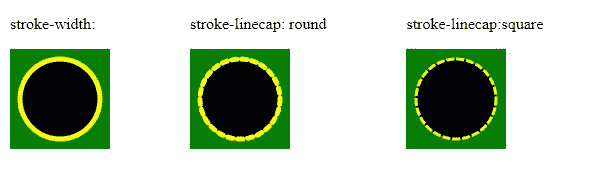

# SVG 笔划属性

> 原文:[https://www.geeksforgeeks.org/svg-stroke-properties/](https://www.geeksforgeeks.org/svg-stroke-properties/)

SVG 提供了几个应用于 SVG 元素的笔画属性。笔画属性下有很多属性，可以应用于任何类型的线条、文本和像圆形这样的元素轮廓。

**语法:**

```html
<elementName stroke="stroke color"
      stroke-width="Width of the stroke"
      stroke-linecap="Ending style to a stroke"
      stroke-dasharray="make a dashed stroke">

```

**属性值:**

*   **笔画:**将笔画设置为一个元素。
*   **笔画宽度:**设置元素的笔画宽度。
*   **笔画线条帽:**设置结束笔画样式。
*   **笔画-dasharray:**设置笔画的样式，如虚线笔画。

下面给出几个例子:

**示例 1:** 笔画和笔画缓冲器阵列属性:

## 超文本标记语言

```html
<!DOCTYPE html>
<html lang="en">
<head>
  <meta charset="UTF-8">
  <meta name="viewport" 
        content="width=device-width, initial-scale=1.0">
  <title>Stroke and stroke-dasharray property</title>
</head>
<style>
  svg{
    background-color: green;
  }
</style>
<body> 

<p>stroke: </p>

  <svg width="100px" height="100px">
      <circle cx="50" cy="50" r="40" 
              stroke="yellow"/>
  </svg>

<p>stroke-dasharray: </p>

  <svg width="100px" height="100px">
      <circle cx="50" cy="50" r="40"
              stroke-dasharray=5 
              stroke="yellow"/>
  </svg>
</body>
</html>
```

**输出:**



**示例 2:** 笔画宽度和笔画线条帽属性:

## 超文本标记语言

```html
<!DOCTYPE html>
<html lang="en">
<head>
  <meta charset="UTF-8">
  <meta name="viewport" 
        content="width=device-width, initial-scale=1.0">
  <title>stroke-width and stroke-linecap property</title>
</head>
<style>
  svg{
    background-color: green;
  }
  .cls{
    display: flex;
  }
  .cl{
    margin:40px;
  }
</style>
<body> 
  <div class="cls">
    <div class="cl">

<p>stroke-width: </p>

      <svg width="100px" height="100px">
          <circle cx="50" cy="50" r="40" 
                  stroke-width=5 
                  stroke="yellow"/>
      </svg>
    </div>
    <div class="cl">

<p>stroke-linecap: round </p>

      <svg width="100px" height="100px">
          <circle cx="50" cy="50" r="40" 
                  stroke-width=5 
                  stroke-linecap="round" 
                  stroke-dasharray=5
                  stroke="yellow"/>
      </svg>
    </div>
    <div class="cl">

<p>stroke-linecap:square </p>

      <svg width="100px" height="100px">
          <circle cx="50" cy="50" r="40" 
                  stroke-width=3 
                  stroke-linecap="square" 
                  stroke-dasharray=5 
                  stroke="yellow"/>
      </svg>
    </div>
  </div>
</body>
</html>
```

**输出:**



**支持的浏览器:**

*   铬
*   边缘
*   歌剧
*   微软公司出品的 web 浏览器
*   旅行队
*   火狐浏览器