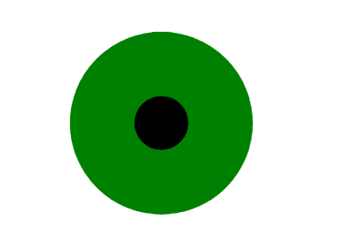

# SVG 笔画宽度属性

> 原文:[https://www.geeksforgeeks.org/svg-stroke-width-attribute/](https://www.geeksforgeeks.org/svg-stroke-width-attribute/)

**笔画宽度**属性是定义应用于形状的笔画宽度的属性。

**语法:**

```html
stroke-width="length"
```

**属性值:**

*   **长度:**我们要设置笔画宽度属性的长度
*   **百分比:**我们要设置笔画宽度属性的百分比

我们将使用笔画宽度属性来设置元素的宽度。

**示例 1:** 在本例中，我们将使用笔画宽度属性来使用长度值设置矩形的宽度。

```html
<!DOCTYPE html>
<html>

<body>
    <svg viewBox="0 0 110 80" 
        xmlns="http://www.w3.org/2000/svg">

        <circle cx="15" cy="15" r="3" 
            stroke="green" stroke-width="11" />
    </svg>
</body>

</html>
```

**输出:**



**示例 2:** 在本例中，我们将使用笔画宽度属性来使用百分比值设置矩形的宽度。

```html
<!DOCTYPE html>
<html>

<body>
    <svg viewBox="0 0 110 80" 
        xmlns="http://www.w3.org/2000/svg">

        <circle cx="20" cy="20" r="6" 
            stroke="green" stroke-width="20%" />
    </svg>
</body>

</html>
```

**输出**

