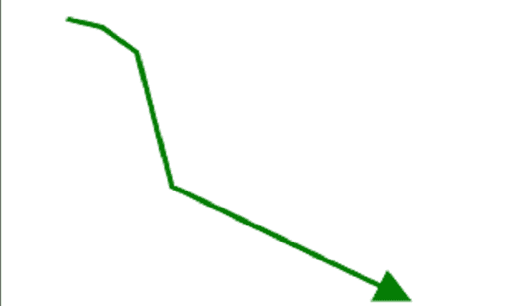
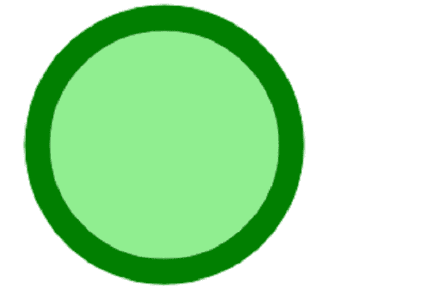

# SVG 风格属性

> 原文:[https://www.geeksforgeeks.org/svg-style-attribute/](https://www.geeksforgeeks.org/svg-style-attribute/)

*样式*属性帮助我们使用 CSS 声明为元素设置样式。它的工作原理非常类似于 HTML 的*风格*属性。几乎所有的元素都在使用这个属性。

**语法:**

```html
style = "<style>"
```

**属性值:**样式属性接受上面提到的和下面描述的值。

*   **样式:**样式数据的语法取决于提供的 CSS。

以下示例说明了*样式*属性的使用。

**例 1:**

## 超文本标记语言

```html
<!DOCTYPE html>
<html>

    <body>

        <svg viewBox="-10 -5 1220 520" 
             xmlns="http://www.w3.org/2000/svg">
            <defs>
                <marker id="geek"
                    viewBox="0 0 10 10"
                    refX="1" refY="5"
                    markerUnits="strokeWidth"
                    markerWidth="7"
                    markerHeight="7"
                    orient="auto">
                   <path d="M 0 0 L 10 5 L 0 10 z" 
                    fill="green"/>
                </marker>
            </defs>

            <polyline points="20, 20 40, 25 60,
                    40 80, 120 120, 140 200, 180"
                    style="fill:none;stroke:green;
                    stroke-width:3" 
                    marker-end="url(#geek)"/>
          </svg>
    </body>   
</html>
```

**输出:**



**例 2:**

## 超文本标记语言

```html
<!DOCTYPE html>
<html>

    <body>
        <svg viewbox="0 0 150 60" 
          xmlns="http://www.w3.org/2000/svg">
          <circle cx="12" cy="12" r="10"
              style="fill: lightgreen; 
              stroke: green; 
              stroke-width: 2;"/>
        </svg>
    </body>

</html>
```

**输出:**

