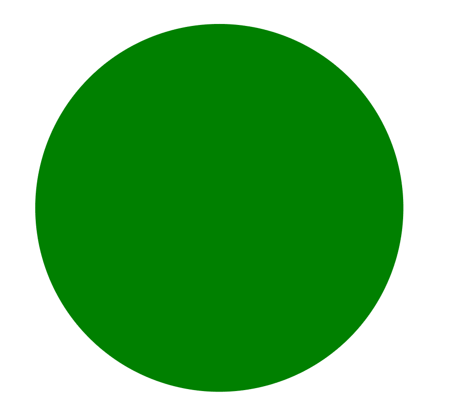
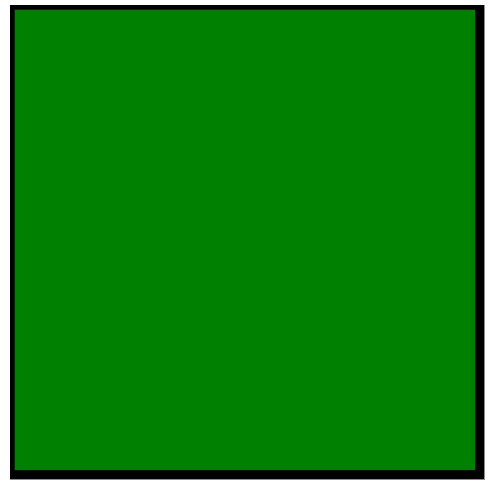

# SVG `<style>`元素

> 原文:[https://www.geeksforgeeks.org/svg-style-element/](https://www.geeksforgeeks.org/svg-style-element/)

SVG 代表可缩放矢量图形。它可以用来制作像在 HTML 画布中的图形和动画。

SVG `<strong>` <样式>元素允许样式表直接嵌入到 SVG 内容中。

**语法:**

```html
<style>
    Styling Content
</style>
```

**属性:**

*   **类型:**要使用的样式表类型。
*   **媒体:**该属性定义样式适用于哪个媒体。
*   **标题:**该属性是样式表的标题，可用于在替代样式表之间切换。
*   **全局属性:**使用了一些全局属性，如核心属性、造型属性等。

**例 1:**

```html
<!DOCTYPE html>
<html>
<body>
    <svg viewBox="0 0 20 20" 
         xmlns="http://www.w3.org/2000/svg">
        <style>
            circle {
              fill: green;
            }
        </style>
        <circle cx="5" cy="5" r="4" />
    </svg>
</body>

</html>
```

**输出:**



**例 2:**

```html
<!DOCTYPE html>
<html>

<body>
    <svg viewBox="0 0 20 20"
         xmlns="http://www.w3.org/2000/svg">
        <style>
            rect {
              fill: green;
              stroke: black;
              stroke-width: .1px;
            }
        </style>
        <rect height="5" width='5'/>
    </svg>
</body>

</html>
```

**输出:**



**支持的浏览器:**此 SVG 元素支持以下浏览器:

*   铬
*   边缘
*   火狐浏览器
*   旅行队
*   微软公司出品的 web 浏览器
*   歌剧