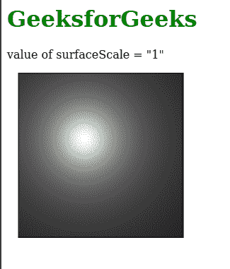
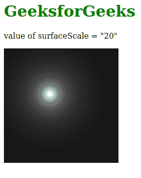

# SVG 曲面比例属性

> 原文:[https://www.geeksforgeeks.org/svg-surfacescale-attribute/](https://www.geeksforgeeks.org/svg-surfacescale-attribute/)

*表面比例*属性用作表面的高度。使用该属性的元素包括<fespeaklarlighting>和*T6【飞散照明>T3】*

**语法:**

```html
surfaceScale = "number"

```

**属性值:***表面比例*属性接受上面提到的和下面描述的值

*   **数字:**该属性值接受数字，如原始整数、正分数、负分数、零、没有前导零的分数等。

**注意:**默认属性值为 1。

**示例 1:** 以下示例说明了 *surfaceScale* 属性的使用。

## 超文本标记语言

```html
<!DOCTYPE html>
<html>

<body>
    <h1 style="color: green;">
        GeeksforGeeks
    </h1>

    <p>
        value of surfaceScale = "1"
    </p>

    <svg viewBox="0 0 820 600" 
        xmlns="http://www.w3.org/2000/svg">

        <filter id="geek1" x="0" y="0" 
            width="100%" height="100%">

            <feDiffuseLighting surfaceScale="1">
                <fePointLight x="60" y="60" z="20" />
            </feDiffuseLighting>
        </filter>

        <rect width="150" height="150" 
            style="filter: url(#geek1);" />
    </svg>
</body>

</html>
```

**输出:**



**例 2:**

## 超文本标记语言

```html
<!DOCTYPE html>
<html>

<body>
    <h1 style="color: green;">
        GeeksforGeeks
    </h1>
    <p>
        value of surfaceScale = "20"
    </p>

    <svg viewBox="0 0 820 600" 
        xmlns="http://www.w3.org/2000/svg">

        <filter id="geeks2" x="0" y="0" 
            width="100%" height="100%">

            <feDiffuseLighting in="SourceGraphic" 
                surfaceScale="20">

                <fePointLight x="60" y="60" z="20" />
            </feDiffuseLighting>
        </filter>

        <rect x="0" y="0" width="150" height="150" 
            style="filter: url(#geeks2);" />
    </svg>
</body>

</html>
```

**输出:**

