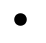

# SVG `<symbol>`元素

> 原文:[https://www.geeksforgeeks.org/svg-symbol-element/](https://www.geeksforgeeks.org/svg-symbol-element/)

SVG 代表可缩放矢量图形。它可以用来制作像在 HTML 画布中的图形和动画。

SVG `<strong>` <符号>元素用于定义图形模板对象，这些对象可以通过<使用>元素进行实例化。在同一文档中多次使用的图形使用符号元素增加了结构和语义。

**语法:**

```html
<symbol attribute="" >
    content Here
</symbol>

```

**属性:**

*   **x:** x 轴坐标图像的定位。
*   **y:** y 轴坐标图像的定位。
*   **宽度:**图像的宽度。
*   **高度:**图像的高度。
*   **视图框:**SVG 元素的边界。
*   **全局属性:**使用了一些全局属性，如核心属性、造型属性等。

**例 1:**

```html
<!DOCTYPE html>
<html>

<body>
    <svg width="400" height="400"
        xmlns="http://www.w3.org/2000/svg">
        <symbol id="circ" 
                width="10" 
                height="10" 
                viewBox="0 0 2 2">
            <circle cx="1" cy="1" r="1" />
        </symbol>       

        <use xlink:href="#circ" x="5"  y="5"/>
    </svg>
</body>

</html>
```

**输出:**一个点符号。



**例 2:**

```html
<!DOCTYPE html>
<html>

<body>
    <svg viewBox="0 0 80 20"
        xmlns="http://www.w3.org/2000/svg">
        <symbol id="circ" 
                width="10" 
                height="10" 
                viewBox="0 0 2 2">
            <rect height="10" width="10" />
        </symbol>       

        <use xlink:href="#circ" x="5" 
             y="5" opacity="0.5" fill="green"/>
    </svg>
</body>

</html>
```

**输出:**


**支持的浏览器:**此 SVG 元素支持以下浏览器:

*   铬
*   边缘
*   火狐浏览器
*   旅行队
*   微软公司出品的 web 浏览器
*   歌剧