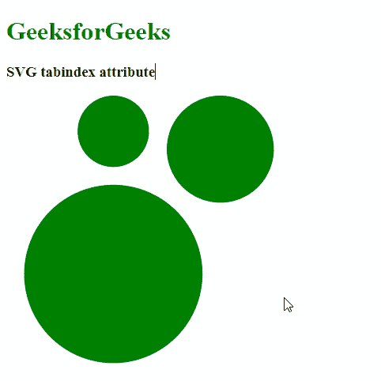
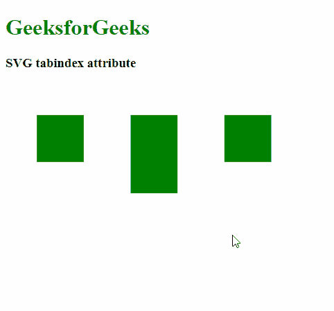

# SVG tabindex 属性

> 原文:[https://www.geeksforgeeks.org/svg-tabindex-attribute/](https://www.geeksforgeeks.org/svg-tabindex-attribute/)

**tabindex** 属性允许用户控制元素是否可聚焦。它还定义了元素聚焦的相对顺序。所有 SVG 元素都可以与该属性一起使用。

**语法:**

```html
tabindex="integer"

```

**属性值:**

*   **整数:**是决定焦点导航相对顺序的整数。

以下示例演示了 tabindex 属性:

**例 1:**

## 超文本标记语言

```html
<!DOCTYPE html>
<html>

<body>
    <h1 style="color: green">
        GeeksforGeeks
    </h1>

    <h3>SVG tabindex attribute</h3>

    <svg viewBox="0 0 500 500" 
        xmlns="http://www.w3.org/2000/svg">

        <circle cx="60" cy="20" r="20" 
            tabindex="1" fill="green" />

        <circle cx="120" cy="30" r="30" 
            tabindex="2" fill="green" />

        <circle cx="60" cy="100" r="50" 
            tabindex="3" fill="green" />
    </svg>
</body>

</html>
```

**输出:**



**例 2:**

## 超文本标记语言

```html
<!DOCTYPE html>
<html>

<body>
    <h1 style="color: green">
        GeeksforGeeks
    </h1>

    <h3>SVG tabindex attribute</h3>

    <svg viewBox="0 0 500 500" 
        xmlns="http://www.w3.org/2000/svg">

        <rect x="20" y="20" width="30" 
            height="30" tabindex="3" 
            fill="green" />

        <rect x="80" y="20" width="30" 
            height="50" tabindex="2" 
            fill="green" />

        <rect x="140" y="20" width="30" 
            height="30" tabindex="1" 
            fill="green" />
    </svg>
</body>

</html>
```

**输出:**

