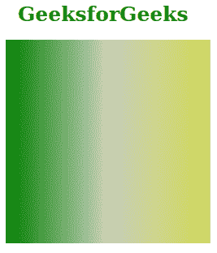
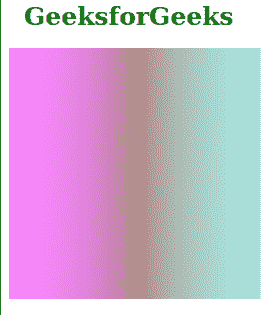

# SVG 表值属性

> 原文:[https://www.geeksforgeeks.org/svg-tablevalues-attribute/](https://www.geeksforgeeks.org/svg-tablevalues-attribute/)

*表值*属性声明了一个数字列表。这些数字定义了颜色分量传递函数值的查找表。使用该属性的元素包括:*<feFuncA><feFuncB><feFuncG>*和 *< feFuncR >。*

**语法:**

```html
tableValues = "list-of-numbers"
```

**属性值:***表值*属性接受上面提到的和下面描述的值

*   **数字列表:**它包含逗号分隔或/和空格分隔的数字/数字列表，该列表声明了颜色分量传递函数的查找表。每个数字可以介于 0 和 1 之间。

以下示例说明了*表值*属性的使用。

**例 1:**

```html
<!DOCTYPE html>
<html>

    <body>
        <h1 style="color: green;
            font-size: 25px; 
            margin-left: 15px;">
            GeeksforGeeks
        </h1>

        <svg viewBox="0 0 1020 200" 
          xmlns="http://www.w3.org/2000/svg">

          <defs>
            <linearGradient id="gradient" 
                gradientUnits="userSpaceOnUse"
                x1="0" y1="0" x2="200" y2="0">
              <stop offset="0" 
                stop-color="green"/>
              <stop offset="0.5" 
                stop-color="#cacfbc"/>
              <stop offset="1" 
                stop-color="#d0d957"/>
            </linearGradient>
          </defs>

          <filter id="geek1" x="0" y="0" 
                width="100%" height="100%">
            <feComponentTransfer>
              <feFuncR type="table" 
                tableValues="0 1"/>
              <feFuncG type="table" 
                tableValues="0 1"/>
              <feFuncB type="table" 
                tableValues="0 1"/>
            </feComponentTransfer>
          </filter>

          <rect x="0" y="0" width="200" 
              height="200" fill="url(#gradient)"
              style="filter: url(#geek1);"/>
        </svg>
    </body>

</html>
```

**输出:**



**例 2:**

```html
<!DOCTYPE html>
<html>

    <body>
        <h1 style="color: green;
            font-size: 25px; 
            margin-left: 15px;">
            GeeksforGeeks
        </h1>

        <svg viewBox="0 0 1020 200" 
          xmlns="http://www.w3.org/2000/svg">
          <defs>
            <linearGradient id="gradient" 
                gradientUnits="userSpaceOnUse"
                x1="0" y1="0" x2="200" y2="0">
              <stop offset="0" 
                stop-color="#2de00d"/>
              <stop offset="0.5" 
                stop-color="#c5e4e6"/>
              <stop offset="1" 
                stop-color="#cf7281"/>
            </linearGradient>
          </defs>

          <filter id="geek2" 
                x="0" y="0" 
                width="100%" height="100%">
            <feComponentTransfer>
              <feFuncR type="table" 
                tableValues="1 0"/>
              <feFuncG type="table" 
                tableValues="1 0"/>
              <feFuncB type="table" 
                tableValues="1 0"/>
            </feComponentTransfer>
          </filter>

          <rect x="0" y="0" width="200" 
              height="200" fill="url(#gradient)"
              style="filter: url(#geek2);"/>
        </svg>
    </body>

</html>
```

**输出:**

