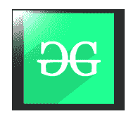
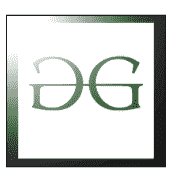
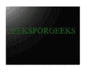

# SVG 标签

> 哎哎哎:# t0]https://www . geeksforgeeks . org/SVG-tag-2/

**<点光源>** 滤镜图元定义了一个光源，可以创建点光源效果。

**语法:**

```html
<fePointLight x="" y="" z="" />

```

**属性:**

*   **x:** 定义用户坐标系中的 x 轴坐标。
*   **y:** 定义用户坐标系中的 y 轴坐标。
*   **z:** 定义用户坐标系中的 z 轴坐标。

**示例:**

## 超文本标记语言

```html
<!DOCTYPE html>
<html>

<body>
    <svg width="200" height="200">
        <defs>
            <filter id="spotlight">
                <feSpecularLighting result="spotlight" 
                    specularConstant="1.9" 
                    specularExponent="500"
                    lighting-color="#FFF">

                    <fePointLight x="10" y="10" z="150" />

                </feSpecularLighting>
                <feComposite in="Backgrou" in2="spotlight" 
                    operator="arithmetic" k1="3" 
                    k2="3" k3="1" k4="0" />
            </filter>
        </defs>

        <image xlink:href=
            "C:/Users/pc/Desktop/gfg/capture42.png" 
            x="10%" y="10%" width="80%" height="80%"
            style="filter:url(#spotlight);" />
    </svg>
</body>

</html>
```

**输出:**



**例 2:**

## 超文本标记语言

```html
<!DOCTYPE html>
<html>

<body>

    <svg width="200" height="200">
        <defs>
            <filter id="spotlight">
                <feSpecularLighting result="spotlight" 
                    specularConstant="1.5" 
                    specularExponent="80"
                    lighting-color="#FFF">

                    <fePointLight x="20" y="20" z="200" />

                </feSpecularLighting>
                <feComposite in="SourceGraphic" 
                    in2="spotlight" operator="arithmetic" 
                    k1="0" k2="1" k3="1" k4="0" />
            </filter>
        </defs>

        <image xlink:href=
            "C:/Users/pc/Desktop/gfg/capture25.png" 
            x="10%" y="10%" width="80%" height="80%"
            style="filter:url(#spotlight);" />
    </svg>
</body>

</html>
```

**输出**:



**例 3:**

## 超文本标记语言

```html
<!DOCTYPE html>
<html>

<body>

    <svg width="200" height="200">
        <defs>
            <filter id="spotlight">
                <feSpecularLighting result="spotlight" 
                    specularConstant="1.5" 
                    specularExponent="80"
                    lighting-color="#FFF">

                    <fePointLight x="12" y="12" z="120" />

                </feSpecularLighting>
                <feComposite in="SourceGraphic" 
                    in2="spotlight" operator="arithmetic" 
                    k1="0" k2="1" k3="1" k4="0" />
            </filter>
        </defs>

        <image xlink:href=
            "C:/Users/pc/Desktop/gfg/capture14.png" 
            x="10%" y="10%" width="80%" height="80%"
            style="filter:url(#spotlight);" />
    </svg>
</body>

</html>
```

**输出:**

