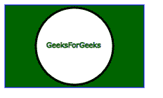
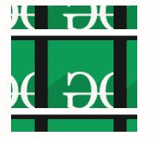
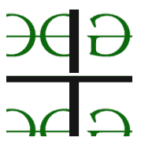

# SVG 标签

> 哎哎哎:# t0]https://www . geeksforgeeks . org/SVG 标签/

**<>**SVG 滤镜图元允许用输入图像的重复平铺图案填充目标矩形。

**语法:**

```html
<feTile in="" x="" y="" width="" height="" />

```

**属性:**

*   **in:**in 属性标识给定过滤器原语的输入。**T3】**
*   **x:** 定义用户坐标系中的 x 轴坐标。
*   **y:** 定义用户坐标系中的 y 轴坐标
*   **宽度:**foreignObject 的宽度。
*   **高度:**foreignObject 的高度。

**例 1:**

## 超文本标记语言

```html
<!DOCTYPE html>
<html>

<body>
    <svg width="200" height="200">
        <filter id="feOffset" x="-40" y="-20" 
            width="100" height="200">
            <feOffset in="SourceGraphic" dx="60" dy="60" />
            <feGaussianBlur stdDeviation="5" result="blur2" />

            <feTile in="SourceGraphic" x="50" 
                y="50" width="100" height="100" />
            <feTile />

        </filter>

        <rect x="1" y="1" width="198" height="118" 
            fill="green" stroke="blue" />
        <circle cx="100" cy="60" r="55" stroke="black" 
            stroke-width="3" fill="white" />
        <g fill="#FFFFFF" stroke="Green" font-size="10" 
            font-family="Verdana">
            <text x="60" y="62">GeeksForGeeks</text>
    </svg>
</body>

</html>
```

**输出**:



**例 2:**

## 超文本标记语言

```html
<!DOCTYPE html>
<html>

<body>
    <svg width="200" height="200">
        <defs>
            <filter id="tile" x="0" y="0" 
                width="100%" height="100%">
                <feTile in="BackgroundImage" x="50" 
                    y="50" width="100" height="100" />
                <feTile />
            </filter>
        </defs>

        <image xlink:href=
            "C:/Users/pc/Desktop/gfg/capture42.png" 
            x="10%" y="10%" width="80%" height="80%"
            style="filter:url(#tile);" />
    </svg>
</body>

</html>
```

**输出:**



**例 3:**

## 超文本标记语言

```html
<!DOCTYPE html>
<html>

<body>
    <svg width="200" height="200">
        <defs>
            <filter id="tile" x="0" y="0" 
                width="100%" height="100%">
                <feTile in="FillPaint" x="100" 
                    y="100" width="120" height="120" />
                <feTile />
            </filter>
        </defs>

        <image xlink:href=
            "C:/Users/pc/Desktop/gfg/capture25.png" 
            x="10%" y="10%" width="80%" height="80%"
            style="filter:url(#tile);" />
    </svg>
</body>

</html>
```

**输出:**

