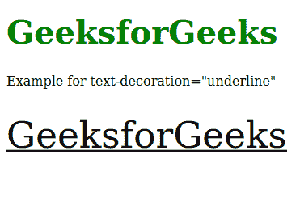

# SVG 文字装饰属性

> 原文:[https://www . geesforgeks . org/SVG-text-decoration-attribute/](https://www.geeksforgeeks.org/svg-text-decoration-attribute/)

*文本修饰*属性定义文本是否用删除线、上划线和/或下划线书写。CSS *文字装饰*属性和 SVG `<em>`文字装饰属性的主要区别在于，SVG 使用“*填充*”和“*描边*值来绘制文字装饰。仅对以下元素 *<替代字形>、<文字>、<文字路径>、< tref >、< tspan >有效。*

**语法:**

```html
text-decoration = "text-decoration-line" | "text-decoration-style" 
                 | "text-decoration-color"

```

**属性值:***文本装饰*属性接受上面提到的和下面描述的值

*   **文字装饰线:**将*文字装饰线*设置为*线通*或*下划线*。
*   **文字-装饰-风格:**设置装饰所用线条的风格，如*实心*、*波浪形、*或*虚线*。
*   **文字-装饰-颜色:**设置装饰的颜色。

**示例 1:** 以下示例说明了*文本装饰*属性的使用。

## 超文本标记语言

```html
<!DOCTYPE html>
<html>

<body>
    <h1 style="color: green; font-size: 40px;">
        GeeksforGeeks
    </h1>

    <p>
        Example for text-decoration="underline"
    </p>

    <svg viewBox="0 0 450 250" 
        xmlns="http://www.w3.org/2000/svg">

        <text y="20" text-decoration="underline">
            GeeksforGeeks
        </text>
    </svg>
</body>

</html>
```

**输出:**



**例 2:**

## 超文本标记语言

```html
<!DOCTYPE html>
<html>

<body>
    <h1 style="color: green; font-size: 40px;">
        GeeksforGeeks
    </h1>

    <p>
        Example for text-decoration="line-through"
    </p>

    <svg viewBox="0 0 450 250" 
        xmlns="http://www.w3.org/2000/svg">

        <text x="0" y="40" 
            text-decoration="line-through">
            GeeksforGeeks
        </text>
    </svg>
</body>

</html>
```

**输出:**

