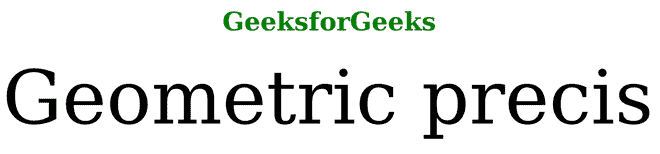

# SVG 文本渲染属性

> 原文:[https://www.geeksforgeeks.org/svg-text-rendering-attribute/](https://www.geeksforgeeks.org/svg-text-rendering-attribute/)

*文本渲染*属性给出了渲染文本时应该签订什么合同的提示。它只对*文本*元素有影响。

**语法:**

```html
text-renderring = auto | optimizeLegibility |
              geometricPrecision | optimizeSpeed
```

**属性值:***文本渲染*属性接受上面提到的和下面描述的值:

*   **auto:** 显示用户代理应制定适当的合同，以平衡几何精度、易读性和速度。
*   **optimizeSpeed:** 它显示用户代理应该关注渲染速度而不是几何精度和易读性。
*   **optimize elevatity:**它告诉用户代理必须关注易读性，而不是几何精度和渲染速度。
*   **geometricPrecision:** 说明用户代理关注的是几何精度，而不是渲染速度和易读性。

**示例 1:** 以下是说明使用*文本渲染*属性的示例

## 超文本标记语言

```html
<!DOCTYPE html>
<html>

<body>
    <h1 style="color:green; 
        font-size:50px; 
        text-align:center;">
        GeeksforGeeks
    </h1>

    <svg viewBox="0 0 140 40" 
        xmlns="http://www.w3.org/2000/svg">

        <text y="15" text-rendering
            ="geometricPrecision">
            Geometric precis
        </text>
    </svg>
</body>

</html>
```

**输出:**



**示例 2:** 以下是说明使用*文本渲染*属性的示例

## 超文本标记语言

```html
<!DOCTYPE html>
<html>

<body>
    <h1 style="color: green; 
        font-size: 50px; 
        text-align: center;">
        GeeksforGeeks
    </h1>

    <svg viewBox="0 0 140 40" 
        xmlns="http://www.w3.org/2000/svg">

        <text y="15" text-rendering
            ="optimizeLegibility">
            Optimized legibility
        </text>
    </svg>
</body>

</html>
```

**输出:**

