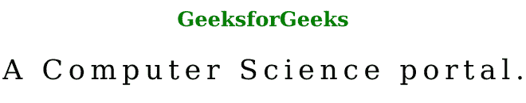

# SVG 文本长度属性

> 原文:[https://www.geeksforgeeks.org/svg-textlength-attribute/](https://www.geeksforgeeks.org/svg-textlength-attribute/)

*文本长度*属性允许您枚举文本所占空间的宽度。通过使用文本长度，您的 SVG 文本将以相同的宽度显示。使用该属性的元素包括: *<文本><文本路径><tref>和< tspan >。*

**语法:**

```html
textLength = length-percentage | number;
```

**属性值:**转换属性接受上面提到的和下面描述的值:

*   **长度-百分比:**它枚举文本所占空间的宽度，以占据绝对长度或百分比。
*   **数字:**是指当前坐标系单位的数值。

以下示例说明了*文本长度*属性的使用

**例 1:**

## 超文本标记语言

```html
<!DOCTYPE html>
<html>

<body>
    <h1 style="color:green; font-size:50px;">
        GeeksforGeeks
    </h1>

    <svg viewBox="0 0 300 160" 
        xmlns="http://www.w3.org/2000/svg">

        <text y="15" textLength="10em">
            A Computer Science portal.
        </text>
    </svg>
</body>

</html>
```

**输出:**


**例 2:**

## 超文本标记语言

```html
<!DOCTYPE html>
<html>

<body>
    <h1 style="color:green; font-size:50px; 
                text-align:center;">
        GeeksforGeeks
    </h1>

    <svg viewBox="0 0 300 160" 
        xmlns="http://www.w3.org/2000/svg">

        <text y="20" textLength="100%">
            A Computer Science portal.
        </text>
    </svg>
</body>

</html>
```

**输出:**

