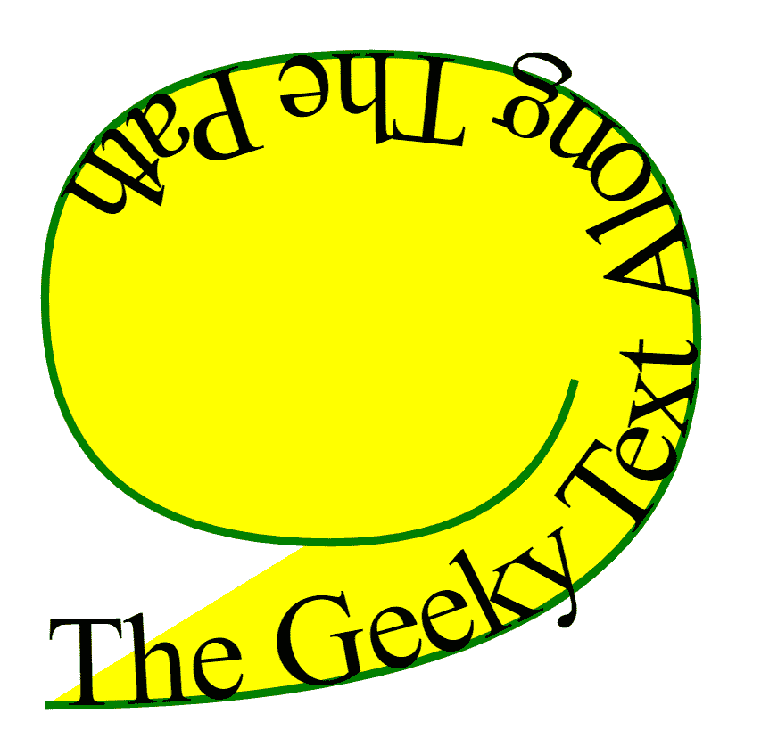

# SVG `<textPath>`元素

> 原文:[https://www.geeksforgeeks.org/svg-textpath-element/](https://www.geeksforgeeks.org/svg-textpath-element/)

SVG 代表可缩放矢量图形。它可以用来制作像在 HTML 画布中的图形和动画。

**<文本路径>** SVG 元素用于沿着特定路径渲染文本。

要沿着某个路径渲染文本，请将文本放在一个 **<【文本路径】>** 元素中，该元素具有一个引用了<路径>元素的 href 属性。

**语法:**

```html
<textPath href="path" >
    Your Text Here
</textPath>

```

**属性:**

*   **href** :要在其上呈现文本的路径或基本形状的网址。
*   **长度调整**:应该对文本进行长度调整的地方。
*   **方法**:沿路径渲染单个字形的方法。
*   **路径**:文本要渲染的路径。
*   **边**:文本应该渲染到路径的哪一边。
*   **间距**:字形之间的间距应该如何处理。
*   **startOffSet** :文字的开头应该从路径的开头偏移多远。
*   **文本长度**:文本将要渲染到的空间的宽度。
*   **全局属性:**使用了一些全局属性，如核心属性、造型属性等。

**示例:**

```html
<!DOCTYPE html>
<html>

<body>
    <svg viewBox="0 0 100 100"
         xmlns="http://www.w3.org/2000/svg">
        <path id="Geek" fill="yellow" stroke="green"
            d="M10,90 Q90,90 90,45 Q90,10 50,10 Q10,
               10 10,40 Q10,70 45,70 Q70,70 75,50" />

        <text>
            <textPath href="#Geek">
                The Geeky Text Along The Path
            </textPath>
        </text>
    </svg>
</body>

</html>
```

**输出:**



**支持的浏览器:**此 SVG 元素支持以下浏览器:

*   谷歌 Chrome
*   微软公司出品的 web 浏览器
*   火狐浏览器
*   苹果 Safari
*   歌剧